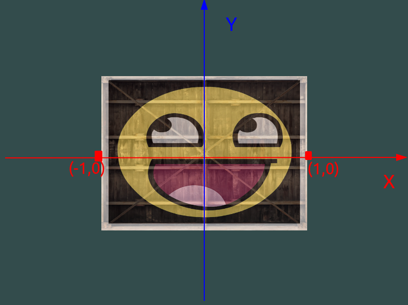
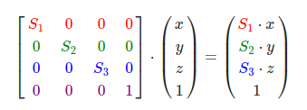
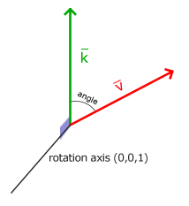
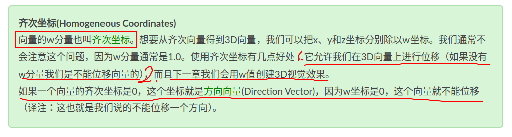

## 1 概述

为了将坐标从一个坐标系变换到另一个坐标系，我们需要用到几个变换矩阵，最重要的几个分别是模型(Model)、观察(View)、投影(Projection)三个矩阵。我们的顶点坐标起始于局部空间(Local Space)，在这里它称为局部坐标(Local Coordinate)，它在之后会变为世界坐标(World Coordinate)，观察坐标(View Coordinate)，裁剪坐标(Clip Coordinate)，并最后以屏幕坐标(Screen Coordinate)的形式结束。下面的这张图展示了整个流程以及各个变换过程做了什么：


1. 局部坐标是对象相对于局部原点的坐标，也是物体起始的坐标。

2. 下一步是将局部坐标变换为世界空间坐标，世界空间坐标是处于一个更大的空间范围的。这些坐标相对于世界的全局原点，它们会和其它物体一起相对于世界的原点进行摆放。

3. 接下来我们将世界坐标变换为观察空间坐标，使得每个坐标都是从摄像机或者说观察者的角度进行观察的。

4. 坐标到达观察空间之后，我们需要将其投影到裁剪坐标。裁剪坐标会被处理至-1.0到1.0的范围内，并判断哪些顶点将会出现在屏幕上。

5. 最后，我们将裁剪坐标变换为屏幕坐标，我们将使用一个叫做视口变换(Viewport Transform)的过程。视口变换将位于-1.0到1.0范围的坐标变换到由glViewport函数所定义的坐标范围内。最后变换出来的坐标将会送到光栅器，将其转化为片段。

## 2 局部空间

局部坐标空间是指，我们创建对象最开始的地方，我们一直使用的那个箱子的顶点是被设定在-0.5到0.5的坐标范围中，(0, 0)是它的原点。这些都是局部坐标。

## 3 世界空间

我们创建的所有物体刚开始都是在局部空间坐标系中，我们不能把所有物体都挤到世界的原点，我们通过<font color="red">模型model矩阵对物体进行位移、缩放、旋转</font>来将它置于你想放到的位置。



经过试验后我的分析与理解：

<font color="lightred">

如果仅仅是模型矩阵对原先的顶点进行变化，其实超过(-1,1)范围的顶点不会在屏幕上面显示（三个轴都一样，范围都是-1到1，Z轴超过该范围也不会显示，可以把屏幕想象成一个方盒子，可以显示的范围(-1,-1,-1）到（1,1,1）。为什么后来超过该范围的顶点还会显示，这和裁剪空间坐标有很大关系，具体如何影响，后面章节讨论。

</font>


## 4 观察空间

观察空间经常被人们称之OpenGL的摄像机(Camera)（所以有时也称为摄像机空间(Camera Space)或视觉空间(Eye Space)）。观察空间是将世界空间坐标转化为用户视野前方的坐标而产生的结果。因此观察空间就是从摄像机的视角所观察到的空间。而这通常是由一系列的位移和旋转的组合来完成，平移/旋转场景从而使得特定的对象被变换到摄像机的前方。这些组合在一起的变换通常存储在一个<font color="red">观察矩阵(View Matrix)里，通过位移和旋转</font>，它被用来将世界坐标变换到观察空间。在下一节中我们将深入讨论如何创建一个这样的观察矩阵来模拟一个摄像机。

经过试验后我的分析与理解：

<font color="lightred">

1. 其实，摄像机只是我们相对感觉的位置，比如我们把正方体往Z轴负方向移动3个单位。你也可以把`-3`看着是正方体的Z轴`0`，这是摄像机就是在`3`位置。

2. 这一阶段，窗口可显示顶点范围还是 (-1, -1, -1) 到 (1, 1, 1)。


</font>



## 5 裁剪空间

为了将顶点坐标从观察空间变化到裁剪空间，我们需要定义一个投影矩阵（Projection Matix），它指定了一个范围的坐标，比如在每个维度上的-1000到1000。投影矩阵接着会将在这个指定的范围内的坐标变换为标准化设备坐标的范围(-1.0, 1.0)。所有在范围外的坐标不会被映射到在-1.0到1.0的范围之间，所以会被裁剪掉。


### 5.1 正射投影

```cpp
/**
 * @brief: 之前通过model和View变化矩阵，每个轴的维度超过了 (-1,1)，我们根据我们要构建的世界，重新将其映射到(-1,1)。比如我们可以设置 (-5,5)，我们的箱子就比之前缩小了五倍。只会显示该范围内的顶点，也就是蓝色截体里面的。
 * @param left: X轴维度的最小值，超过该最小值的顶点就不会显示。
 * @param right: X轴维度的最大值
 * @param bottom: Y轴维度的最小值
 * @param top: Y轴维度的最大值
 * @param zNear: Z轴维度的最大值
 * @param zFar: Z轴维度的最小值
*/
glm::ortho(T left, T right, T bottom, T top, T zNear, T zFar)
```

1. 从下图我们可以看到，经过投影矩阵，原先的坐标都按比例缩小了五倍。（也可以根据每个轴，缩小不一样的倍数，不一定都是五倍）。

2. 如果我们设置W分量不为`1`，`(x,y,z)` 会分别除以 `w` 分量。






### 5.2 透视投影


<font color="lightred">

</font>

## 6 Z缓冲


## 参考

[参考1：坐标变换矩阵详细计算过程](https://blog.songjiahao.com/archives/993)