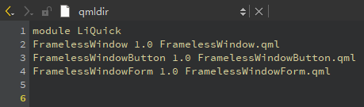

## 1 窗口类型

在Qt Quick中，`ApplicationWindow` 和 `Window` 是用于创建应用程序窗口的两个重要元素。

### 1.1 Window

- 是 `QtQuick` 模块中的一个类型，用于创建独立的窗口或弹出窗口。

- 不提供应用程序窗口的结构，需要自行定义窗口的外观和功能，如菜单栏、工具栏、页面视图等。

  

### 1.2 ApplicationWindow

- 是 `QtQuick.Controls` 模块中的一个元素，用于创建应用程序的顶级窗口。

- `ApplicationWindow` 继承 `Window` 类型，额外添加了标题栏、工具栏、页面视图等属性。

  

## 2 QtQuick.Controls多种风格

- QtQuick.Controls：基本控件。

- QtQuick.Templates：为控件提供行为化的、非可化视的基本类型。

- QtQuick.Controls.Imagine：为Imagine主题风格提供支持。

- QtQuick.Controls.Material：为Material主题风格提供支持。

- QtQuick.Controls.Universal：为Universal主题风格提供支持。

- Qt.labs.platform：支持常用对话框，如文件、颜色等，以及系统图标和标准路径。

  

## 3 Qt创建qml程序分析

https://blog.csdn.net/u010822106/article/details/136884048