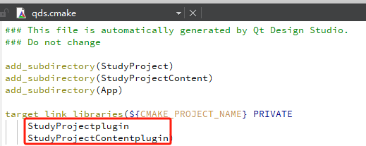

本章节记录，如何创建 `Qt Design Studio` 和 `Qt Creator` 共同开发项目。

## 1 创建共同开发项目

### 1.1 创建一个 `Qt Design Studio` 项目

创建一个 `Qt Design Studio` 项目

使能该项目 `Enable CMake Generator`

### 1.2 使用 `Qt Creator` 打开CMakeLists

### 1.3 `Qt Creator` 编译失败问题

#### 1.3.1 由于 `Windows` 长路径问题，导致编译失败。

**解决方案**：

通常是使用较短的路径，比如：`C:\dev`

`Qt Creator 13` 提出了一种不同的解决方法，对源项目目录和构建目录使用**软连接**。

一共有两种方法，一个是对于所有使用 `Qt Creator` 项目都使用，另一个是仅仅对目前项目使用。

第一种：通过设置 `CMake` 对所有项目都启用。

第二种：通过设置 `CMakeLists.txt.shared` 单独启用 `QTC_CMAKE_USE_JUNCTIONS` 

通过在软连接目录创建和删除问题，相应的源目录的文件也会变化。

## 2 项目CMakeLists分析
主目录下的 `CMakeLists.txt` 会调用以下几个部分构建应用程序 `qds.cmake`、`App`、`cmake`、`StudyProject`、`StudyProjectContent` 里面的 `CMakeLists.txt` 或 `***.cmake` 文件。

### 2.1 关于qml库问题

比如 `StudyProject` 目录里面定义了

`qds.cmake` 却只调用了 `libStudyProjectContentplugin.a` 静态库，但是看编译文件 `build.ninja` ，编译应用程序的时候也调用了 `libStudyProjectContent.a` 静态库。

我猜：`libStudyProjectContentplugin.a` 应该是依赖  `libStudyProjectContent.a` 静态库。

### 2.2 关于 `qmlcomponents` 库

这部分是 `Qt Design Studio` 定义的 qml组件，比如：`ArcItem`、`Glow` 、`QuickStudioApplication` 等等。

## 参考

[参考1：Designer-Developer Workflow](https://doc.qt.io/qtdesignstudio/studio-designer-developer-workflow.html)

[参考2：长路径问题](https://www.qt.io/blog/qt-creator-13-cmake-update)