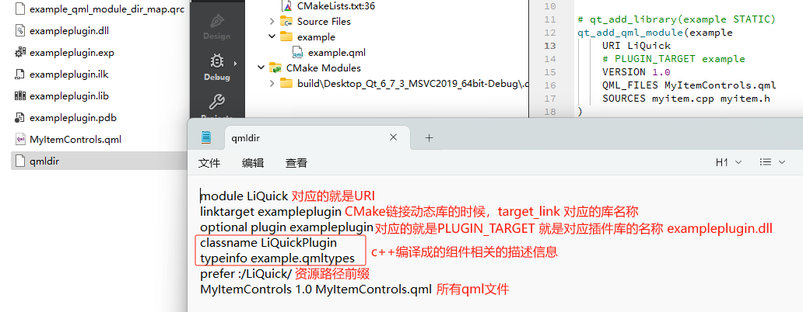
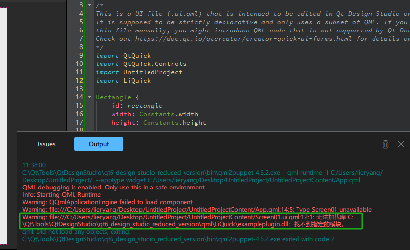

QtQuick Controls控件有几种风格：

### Basic Style

基本风格是一个简单和轻量级的全方位风格，为Qt快速控制提供了最大的性能。

### Fusion Style

Fusion Style的轻主题。融合风格的黑暗主题。融合风格是一种平台无关的风格，为Qt快速控件提供了面向桌面的外观和感觉。

### Imagine Style

### Universal Style

基于微软Window类似的风格

### Material Style

## 参考

[参考1：Styling Qt Quick Controls](https://doc.qt.io/qt-6/qtquickcontrols-styles.html#universal-style)