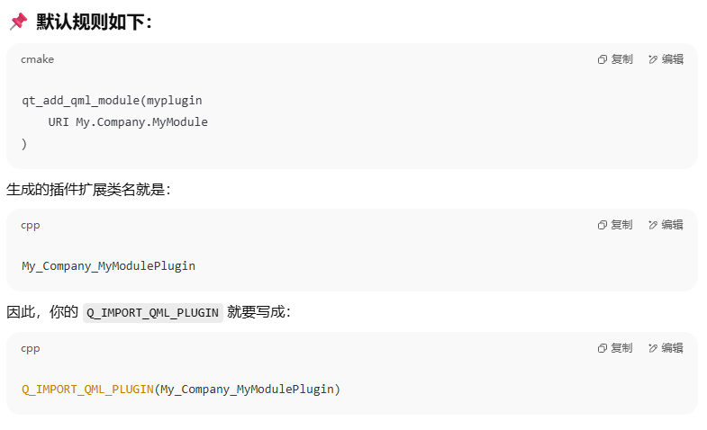

## 2.1 GUI程序结构与运行机制

本小节2.1对应的示例程序是 [samp1_1HelloWorld_qmake](/assets/Qt6/ChapterTwo/code/samp2_1/)

### 2.1.1 GUI项目文件组成

- **samp2_1.pro**: 是qmake构建系统的项目配置文件，其中存储了项目的各种设置内容。
- **widget.ui**: 是UI文件，这是用于窗口界面可视化设计的文件。
- **main.c**: 是主程序文件，包含main()函数。
- **widget.h**: 是窗口类定义头文件，它用到了UI文件widget.ui中的一个可视化设计的窗口界面。
- **widget.cpp**: 是对应于widget.h的源程序文件。

### 2.1.2 项目配置文件

1. 如果使用qmake构建系统，就会生成后缀 `.pro` 的项目配置文件（通过点击.pro文件，就可以打开项目）。

2. qmake类似cmake，会自动生成Makefile文件。

3. qmake包含了支持Qt开发的附加功能，能够自动包含元对象编译器（meta-object compiler，MOC）和用户界面编译器（user interface compiler，UIC）生成构建规则。

如果需要更多qmake细节内容，具体可以参考Qt帮助文档的qmake Manual主题。qmake还能为Microsoft Visual Studio生成项目，而无需开发者更改项目文件。

**补充内容：**

**补充内容1：元对象系统**

Qt元对象系统(Meta-Object-System)是由Qt Core实现的，所以要想使用元对象系统，就必须要在项目配置文件中 `QT += core`。

元对象系统是一个基于标准C++的扩展，为QT提供了：

- 信号与槽机制

- 实时类型信息

- 动态属性系统

元对象系统的三个基本条件:类必须继承自QObject、类声明Q_OBJECT宏(默认私有)、元对象编译器moc。

信号与槽机制是QT的核心机制，信号与槽是一种高级接口，应用于对象之间的通信。信号和槽是QT自行定义的一种通信机制，它独立于标准的C/C++语言，要正确的处理信号和槽，必须借助一个称为moc(Meta-Object-Compiler)，也就是"元对象编译器"。

它为高层次的事件处理自动生成所需要的必要代码。QT程序在交由标准编译器编译之前，先要使用moc分析C++源文件。如果moc发现在一个类头文件中包含了函Q_OBJECT，则会生成以moc_className.cpp(自定义类名)的.cpp文件。这个源文件中包含了Q_OBJECT宏的实现代码。新的文件同样将进入编译系统，与源文件一起参与编译。构建生成的.o文件包含与moc生成的.cpp文件中。

下面就是每个类开始要定义 `Q_OBJECT` 宏：

MOC元对象编译器会检查文件中是否定义 `Q_OBJECT` 宏,然后生成 `moc_className.cpp` 文件。（该文件就是宏里面函数的实现）

qmake就含有MOC编译器。

**补充内容2：UIC**

我们使用 `Qt Designer` 软件编辑 `*.ui` 文件，但是C++并不能直接编译该文件，所以UIC就是把 `*.ui` 文件生成 `ui_***.h` 头文件。

**补充内容3：rcc：**

Qt 自带的开发工具集里有专门的 rcc 工具，用于将 .qrc 资源里面描述的图片、文档等编译成对应的源代码文件 qrc_***.cpp

### 2.1.3 UI文件

双击 `Forms` 里面的 `widget.ui` 文件，即可打开，UI编辑页面。

1. 修改构建的对象名称

    

2. 按钮btnClose的 `clicked()` 信号连接窗口Widget的 `close()` 槽函数。

    

### 2.1.4 主程序文件

### 2.1.5 窗口相关的文件

首先要区分两个类：

1. 基于 `QWidget` 的窗口 `Widget` 类。继承自 QWidget 的类 Widget 的
定义。Widget 类中包含创建窗口界面，实现窗口上界面组件的交互操作，以及其他业务逻辑。

1. 基于 `Ui_Widget` 的 `Widget` 类。这个 `Ui::Widget *ui`其实是我们窗口类 `Widget` 的一个私有成员。用于描述窗口类`Widget`，我们在 UI 文件中界面组件的属性设置、布局以及信号与槽的关联等内容。

## 2.2 可视化UI设计

**补充内容1：控件大小策略（QWidget Size Policy）**

- **sizeIncrement**：它定义了窗口的大小调整增量，即用户在调整窗口大小时，窗口的宽度和高度如何按照特定的步长进行变化。

    sizeIncrement 是一个 QSize 类型的值，它指定了宽度和高度的增量步长。例如，如果你设置 sizeIncrement 为 (10, 15)，那么在调整窗口大小时，窗口宽度将以 10 像素的增量变化，高度将以 15 像素的增量变化。

- **baseSize**：它定义了窗口大小的基准尺寸。在这个基础上，窗口的大小按照 sizeIncrement 来变化。

    baseSize 是一个 QSize 类型的值，表示窗口的初始宽度和高度。调整窗口大小时，每次增量都是基于这个基准值的。例如，设置 baseSize 为 (100, 150) 并设置 sizeIncrement 为 (10, 15)，那么窗口的宽度和高度将从 100 和 150 开始，按照 10 和 15 的步长增加。

QSizePolicy::Fixed：控件将保持固定的尺寸，不会随父控件的大小改变而改变。

QSizePolicy::Minimum：控件将尽可能小，但不会小于其最小尺寸。

QSizePolicy::Maximum：控件将尽可能大，但不会超过其最大尺寸。

QSizePolicy::Preferred：控件有一个首选尺寸，布局管理器会尽量遵循这个尺寸，但可以调整大小以适应布局需求。

QSizePolicy::Expanding：控件将尽可能地扩展以填充可用的空间，适用于希望占据额外空间的控件。

minimumSize：Widget最大尺寸

maxmumSize：Widget最小尺寸

总结：

1. 总结头文件声明的函数转到定义

https://blog.csdn.net/qq_43341440/article/details/117824635

https://blog.csdn.net/qq_39662022/article/details/136500671

2. 转到槽的槽函数连接原理

通过ui_widget.cpp 文件的信号名称跟槽函数名称规则， moc 文件的执行

3. 伙伴关系

4. Help -> about Plugins 中的 clang是个什么的，为什么会有错误不正常提升

### 2.2.1 窗口界面可视化设计

### 2.2.2 界面组件布局管理

### 2.2.3 信号和槽简介

### 2.2.4 信号与槽的使用

### 2.2.5 为应用程序设置图标

### 2.2.6 Qt项目构建过程基本原理

## 2.3 代码化UI设计

### 2.3.1 示例功能概述

### 2.3.2 示例功能实现

## 2.4 使用CMake构建系统

### 2.4.1 CMake项目配置

### 2.4.2 CMake项目构建

### 2.4.3 使用cmake-gui生成Visual Studio项目

## 2.5 Qt Creator使用技巧

### 2.5.1 文本编辑器使用技巧

### 2.5.2 项目管理

### 2.5.3 代码模型