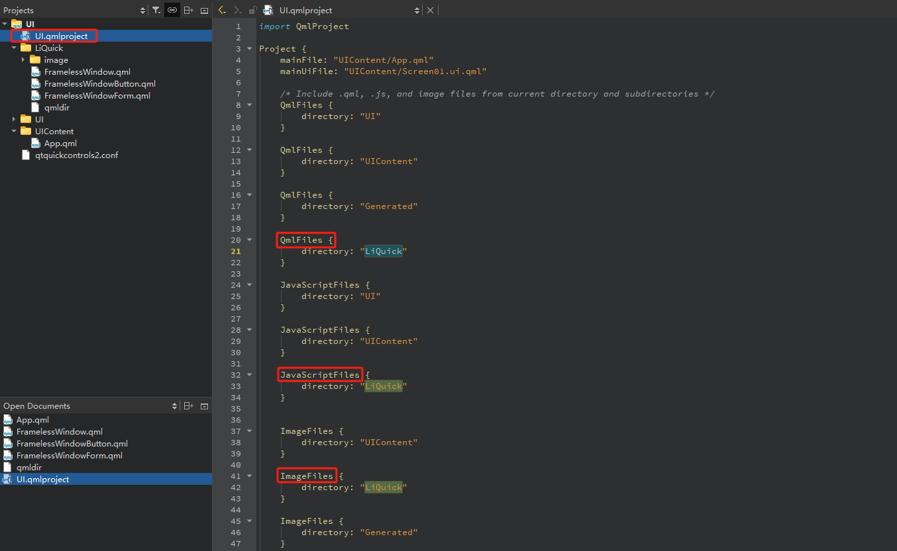

`Qt Design Studio` 定义用户界面的外观和风格，从线框图到最终实现，使用预设的UI组件。将2D和3D设计工具中的UI设计文件导入到Qt Design Studio，它可以将这些文件转换为开发人员使用的代码。Qt Design Studio的原型设计功能使您的设计栩栩如生，并模拟和验证交互和动态行为。您可以在桌面或目标设备上实时测试、预览并精确调整您的设计，达到像素级的完美。

## 1 Log In UI - Components

按照**绿色**标准的序号，进行依次修改信息创建一个空项目。

创建成功之后，我们打开 `Loginnui1` 目录，看一下里面有哪些文件，作用分别是什么。

- **Constants.qml**：QML文件，通常定义了常量值，如颜色、字体大小等，这些值在整个项目中共享使用。

- **DirectoryFontLoader.qml**：用于加载字体资源的QML文件，可能会动态加载字体或从特定目录中获取字体资源。

- **EventListModel.qml**：定义一个事件列表的数据模型，可能用于展示一系列事件的列表或其他类似的数据展示功能。

- **EventListSimulator.qml**：用于模拟事件列表的数据，用于开发或测试时提供伪造的事件数据。

- **qmldir**：QML模块定义文件。它告知Qt QML引擎如何定位和加载模块中的QML文件和资源。

- **designer/plugin.metainfo**：设计器插件的元数据文件，通常由Qt Design Studio生成，包含插件相关的信息，如插件的ID、版本等。

**`Loginnui1Content` 文件夹内容如下：**

将图片和字体相关文件拷贝到 `fonts` 或者 `images` 文件夹后，设计界面的资源项里面会自动显示所有文件。

## 参考

[参考1：Qt Design Studio Manual页面](Qt Design Studio Manual)