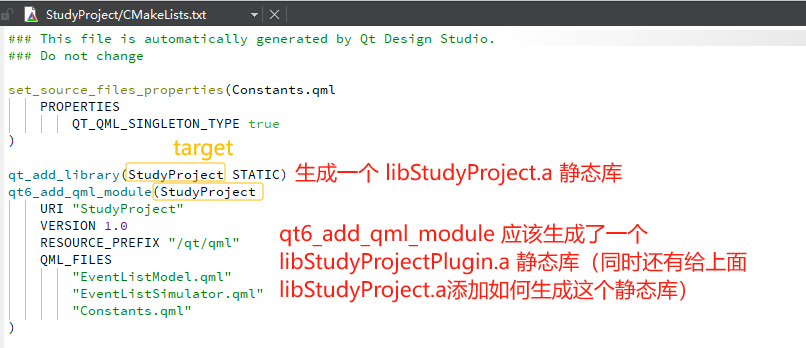
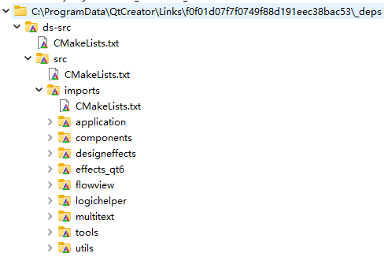

`Qt Design Studio` 定义用户界面的外观和风格，从线框图到最终实现，使用预设的UI组件。将2D和3D设计工具中的UI设计文件导入到Qt Design Studio，它可以将这些文件转换为开发人员使用的代码。Qt Design Studio的原型设计功能使您的设计栩栩如生，并模拟和验证交互和动态行为。您可以在桌面或目标设备上实时测试、预览并精确调整您的设计，达到像素级的完美。

## 1 Log In UI - Components

按照**绿色**标准的序号，进行依次修改信息创建一个空项目。

创建成功之后，我们打开 `Loginnui1` 目录，看一下里面有哪些文件，作用分别是什么。

- **Constants.qml**：QML文件，通常定义了常量值，如颜色、字体大小等，这些值在整个项目中共享使用。

- **DirectoryFontLoader.qml**：用于加载字体资源的QML文件，可能会动态加载字体或从特定目录中获取字体资源。

- **EventListModel.qml**：定义一个事件列表的数据模型，可能用于展示一系列事件的列表或其他类似的数据展示功能。

- **EventListSimulator.qml**：用于模拟事件列表的数据，用于开发或测试时提供伪造的事件数据。

- **qmldir**：QML模块定义文件。它告知Qt QML引擎如何定位和加载模块中的QML文件和资源。

- **designer/plugin.metainfo**：设计器插件的元数据文件，通常由Qt Design Studio生成，包含插件相关的信息，如插件的ID、版本等。

**`Loginnui1Content` 文件夹内容如下：**

将图片和字体相关文件拷贝到 `fonts` 或者 `images` 文件夹后，设计界面的资源项里面会自动显示所有文件。

在开始设计自定义按钮之前，需要先了解一下Qt Design Studio的view视图菜单栏，因为有几个视图是经常会用到的。

以下只是简单描述以下教程，具体还是参考官网

1. 分别拖拽图片 `adventurePage.jpg` 和 `qt_logo_green_128x128.png` 到 `Screen01.ui.qml` 页面中。图片的长、宽以及位置可以自行设定。

    

2. 拖拽 `Text` 组件到区域中，设置字体属性参数。

    

3. 创建了一个名为 `EntryField` 的 `Custom Button`。

    
  
    修改 `EntryField` 相关属性。注意：通过 `Navigator` 视图可以选择 `Button` 里面的背景矩形和文本组件的属性设置。

    

    

    

    

    修改其他状态下无变化。

    

4. 创建一个名为 `PushButton` 的 `Custom Button`。
    

    

    

    修改 `normal` 和 `down` 状态   

    

5. 分别拖拽 `EntryField` 和 `PushButton` 到 `Screen01.ui.qml` 中。如图所示：
    
    

    

**为什么不能修改 `EntryField` 和 `PushButton` 中 `textItem` 的 `text` 属性?**

答：因为外部不能直接修改 `EntryField` 组件内的 `textItem.text` ，通过 `Button.text` 绑定到组件内的 `textItem.text`。如果我们修改了  `textItem.text`,就不是绑定了，所以后来外部也修改不了 `text` 内容了。

## 2 Log In UI - Positioning

## 参考

[参考1：Qt Design Studio Manual页面](https://doc.qt.io/qtdesignstudio/gstutorials.html)