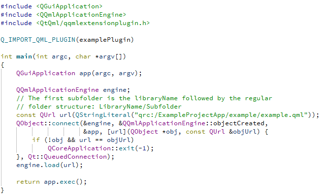

1. 创建3D项目

    

2. 删除 `Text` 和 `cubeModel`，删除完成后，如图所示：
    

3. 在 `Navigator` 视图里面，选择 `Rectangle`，设置属性背景颜色为 `#000000`   
     

4. 添加 `QtQuick3D.Particles3D` 模块到项目中。
     
     

5. 拖住一个粒子系统模版 `Animated Sprite` 到 `scene` 中。

    

6. 