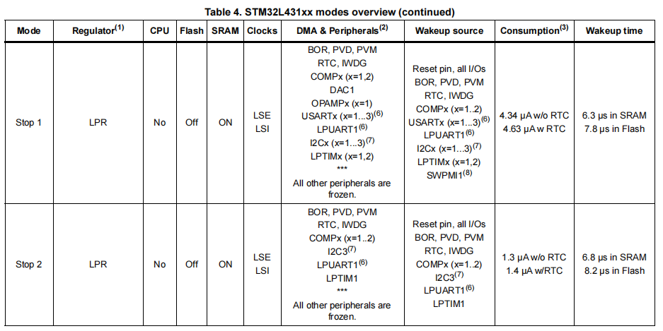
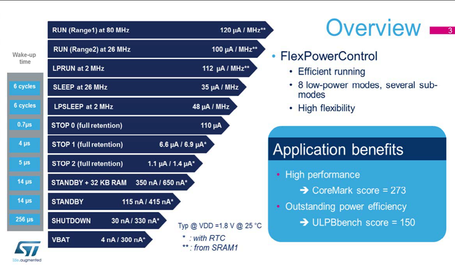

## 1 EtherCat概述

### 1.1 特性（可以简单看看）

1. 开发的技术：EtherCAT全称EtherNet Control Automation Technology，是由德国倍福（Beckhoff）公司提出的一种实时以太网技术。EtherCAT是一种开放但不开源的技术，意味着您可以任意使用这项技术，但若要进行相关设备的开发，则需要向倍福公司获取相关授权。

2. 快速性：相比传统现场总线，EtherCAT的数据传输速率有了极大的提升，可选10Mbit/s或100Mbit/s，甚至依托补充的EtherCAT G技术，传输速率可达1000Mbit/s；同时EtherCAT基于标准以太网帧传输，单帧数据用容量可达1486 Bytes。这使得在传输数据量方面EtherCAT有无比的优越性。

    

3. 拓扑的灵活性：EtherCAT几乎支持所有的拓扑结构：星型、线性、树型、菊花链型等，并支持各类电缆、光纤等多种通信介质，还支持热插拔特性，保证了各设备之间连接的灵活性。同时EtherCAT几乎没有设备容量限制，最大从站设备数可达65535个，使得网络中无需交换机的存在，仅通过设备间的拓扑结构即能使得EtherCAT数据直达每个从站。
   
      

4. 同步的精准性：对于像多个伺服轴执行协同运动等一类应用，其对数据同步性要求甚高。而EtherCAT可选择使用分布式时钟（DC）的方式同步节点，并采用完全基于硬件的时间校准机制，使得整个系统抖动时间远小于1us，能够完全适用于这样的应用之下。如下图所示，300个EtherCAT站点间的信号时间抖动仅有20ns：
      
      

5. 高可用性：EtherCAT可通过简单的措施实现线缆的冗余性。通过将网络中最后一个站点与主站设备中的以太网端口连接，即可将线型拓扑结构扩展为环型冗余拓扑结构。当线缆损坏或站点故障发生时，主站堆栈中的附加软件检测就会检测到，并立刻切到换冗余线路中运行，而各站点无需为此而改变，甚至不会意识到网络通信正在冗余线路中运行。
      
      

### 1.2 网络架构

EtherCat网络运行原理如下图所示。

以太网设备之间接收和发送标准的ISO/IEC8802-3**以太网数据帧**，这些从站可以直接处理接收到的**子报文**，并对这些报文进行相应的加工，例如**提取**某些数据或**插入**需要的用户数据，之后将加工之后的报文传输给**下一个**EtherCAT从站。

最后一个EtherCAT从站的功能则是发回经过完全处理的报文，并由第一个从站作为相应报文将其发送给控制单元。

每个从站的数据并非使用各自独立的以太网帧，而是把每个从站的以太网帧合并在一起。

这是因为etherCat网络采用的是中央调度机制，而不是独立竞争机制。

- 下行：主站可以通过一个以太网帧，同时控制多个从站设备，提升了系统的实时性。

- 上行：主站通过通过一个以太网帧，同时获取多个从站设备发来的数据，提升了系统的实时性。

## 2 ISO/OSI参考模型

EtherCAT网络只有物理层（PHL）、数据链路层（DLL）和应用层（APL）。

以太网协议就是数据链路层的协议

### 2.1 应用层协议

应用层协议分为多种类型：CoE， SoE，EoE, FoE。应用层是EtherCAT协议最高的功能层。应用层向上为应用程序提供服务，向下与网络接口通信。

#### 2.1.1 CoE (CANopen over EtherCAT)

- 将CANopen协议移植到EtherCAT上，用于配置和诊断。继承了CANopen的对象字典概念，便于设备参数的统一管理。

- 支持SDO（服务数据对象）和PDO（过程数据对象）通信。

- 常用于传感器、执行器等设备的实时数据交换和配置。

#### 2.1.2 SoE (Servo Drive Profile over EtherCAT)

- 专用于伺服驱动器控制的实时数据通信协议标准。

- 定义了伺服驱动器的控制和状态数据结构，包括速度、位置和电流控制等.

#### 2.1.3 FoE (File Access over EtherCAT)

- 提供文件传输服务，用于固件更新、配置文件传输等。

- 主要用于非实时数据传输，文件传输速率受限于EtherCAT的整体通信性能

#### 2.1.4 EoE (Ethernet over EtherCAT)

- 允许在EtherCAT网络上传输标准的以太网帧，实现EtherCAT与传统以太网设备的互联。

- 支持TCP/IP协议栈的通信，可以在EtherCAT网络中传输常规的以太网数据包。

#### 2.1.5 AoE (ADS over EtherCAT)

- 基于Beckhoff的ADS（Automation Device Specification）协议，实现不同控制系统之间的数据交换。

- 支持设备间的复杂数据通信和远程诊断

## 3 分布时钟（DC）

在控制系统使用中，多个空间分布的轴可能需要同时运动，分布时钟即用于精确同步这些空间分布轴的运动。

最有效的同步方法是精确校准分布式时钟，正如新IEEE1588标准中所述。与完全同步通信相比，在发生通信故障时同步质量会立即受到影响，而分布式校准时钟对通信系统内可能出现的故障相关延迟具有很高的容忍度。

使用 EtherCAT，数据交换完全基于纯硬件机器。由于通信采用逻辑（并且得益于全双工快速以太网也是物理的）环形结构，因此母时钟可以简单而准确地确定各个子时钟的运行时间偏移 - 反之亦然。分布式时钟根据此值进行调整，这意味着可以获得非常精确的网络范围时间基准，抖动明显小于 1 微秒。

然而，高分辨率分布式时钟不仅用于同步，还可以提供有关数据采集本地时间的精确信息。例如，控制器经常根据连续测量的位置计算速度。特别是在采样时间非常短的情况下，位移测量中即使很小的时间抖动也会导致速度发生很大的阶跃变化。EtherCAT 引入了新的扩展数据类型作为逻辑扩展（时间戳和过采样数据类型）。本地时间与测量值相关联，分辨率高达 10 ns，这得益于以太网提供的大带宽。速度计算的精度不再取决于通信系统的抖动。它比基于无抖动通信的测量技术好几个数量级。

## 参考

[参考1：EtherCat从站 - EtherCAT协议栈与工作原理, 软硬件解决方案](https://blog.csdn.net/HiWangWenBing/article/details/131506688)

[参考2：EtherCAT协议基础知识(Part 1)](https://zhuanlan.zhihu.com/p/264356961)