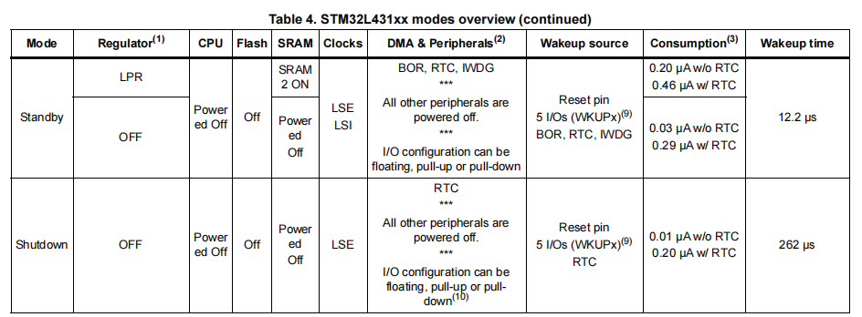

## 1 EtherCat概述

### 1.1 特性（可以简单看看）

1. 开发的技术：EtherCAT全称EtherNet Control Automation Technology，是由德国倍福（Beckhoff）公司提出的一种实时以太网技术。EtherCAT是一种开放但不开源的技术，意味着您可以任意使用这项技术，但若要进行相关设备的开发，则需要向倍福公司获取相关授权。

2. 快速性：相比传统现场总线，EtherCAT的数据传输速率有了极大的提升，可选10Mbit/s或100Mbit/s，甚至依托补充的EtherCAT G技术，传输速率可达1000Mbit/s；同时EtherCAT基于标准以太网帧传输，单帧数据用容量可达1486 Bytes。这使得在传输数据量方面EtherCAT有无比的优越性。

    

3. 拓扑的灵活性：EtherCAT几乎支持所有的拓扑结构：星型、线性、树型、菊花链型等，并支持各类电缆、光纤等多种通信介质，还支持热插拔特性，保证了各设备之间连接的灵活性。同时EtherCAT几乎没有设备容量限制，最大从站设备数可达65535个，使得网络中无需交换机的存在，仅通过设备间的拓扑结构即能使得EtherCAT数据直达每个从站。
   
      

4. 同步的精准性：对于像多个伺服轴执行协同运动等一类应用，其对数据同步性要求甚高。而EtherCAT可选择使用分布式时钟（DC）的方式同步节点，并采用完全基于硬件的时间校准机制，使得整个系统抖动时间远小于1us，能够完全适用于这样的应用之下。如下图所示，300个EtherCAT站点间的信号时间抖动仅有20ns：
      
      

5. 高可用性：EtherCAT可通过简单的措施实现线缆的冗余性。通过将网络中最后一个站点与主站设备中的以太网端口连接，即可将线型拓扑结构扩展为环型冗余拓扑结构。当线缆损坏或站点故障发生时，主站堆栈中的附加软件检测就会检测到，并立刻切到换冗余线路中运行，而各站点无需为此而改变，甚至不会意识到网络通信正在冗余线路中运行。
      
      

### 1.2 网络架构

EtherCat网络运行原理如下图所示。

以太网设备之间接收和发送标准的ISO/IEC8802-3**以太网数据帧**，这些从站可以直接处理接收到的**子报文**，并对这些报文进行相应的加工，例如**提取**某些数据或**插入**需要的用户数据，之后将加工之后的报文传输给**下一个**EtherCAT从站。

最后一个EtherCAT从站的功能则是发回经过完全处理的报文，并由第一个从站作为相应报文将其发送给控制单元。

每个从站的数据并非使用各自独立的以太网帧，而是把每个从站的以太网帧合并在一起。

这是因为etherCat网络采用的是中央调度机制，而不是独立竞争机制。

- 下行：主站可以通过一个以太网帧，同时控制多个从站设备，提升了系统的实时性。

- 上行：主站通过通过一个以太网帧，同时获取多个从站设备发来的数据，提升了系统的实时性。

## 2 ISO/OSI参考模型

EtherCAT网络只有物理层（PHL）、数据链路层（DLL）和应用层（APL）。

以太网协议就是数据链路层的协议

## 参考

[参考1：EtherCat从站 - EtherCAT协议栈与工作原理, 软硬件解决方案](https://blog.csdn.net/HiWangWenBing/article/details/131506688)

[参考2：EtherCAT协议基础知识(Part 1)](https://zhuanlan.zhihu.com/p/264356961)