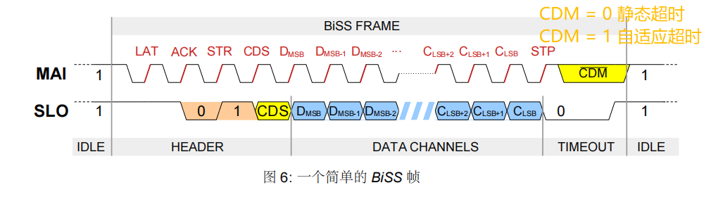
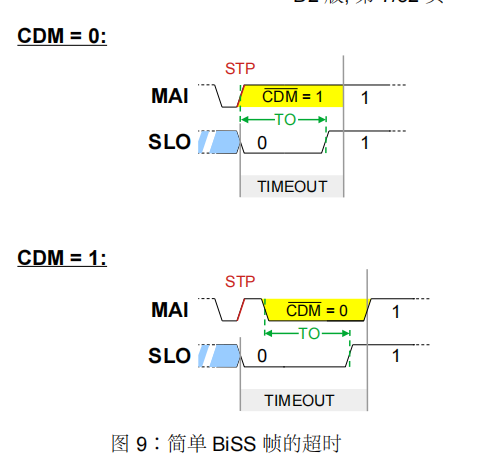
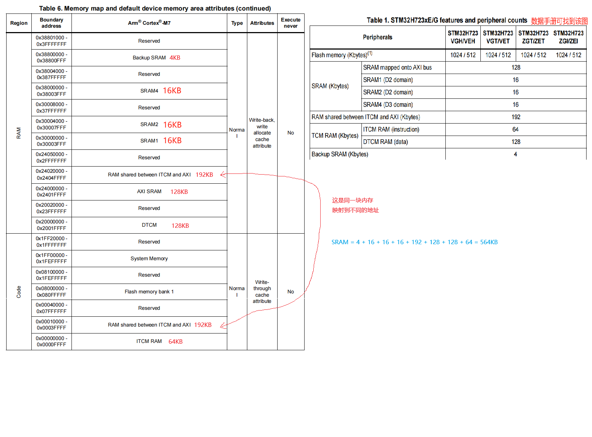

## 1 STM32H723内存映射

这部分内容可以在下面文档中找到：

以下是STM32H723/733系列内存映射图

### 1.1 SRAM

STM32H7的SRAM不是连续的，分成了以下几类：

- TCM RAM：Tightly Coupled Memory（TCM，紧耦合内存），TCM时钟频率跟CPU频率一样，不需要再使用Cache进行加速。所以MPU不需要配置这个区域的内存。

    - ITCM RAM（指令）：ITCM 是用于存放指令的高速内存，CPU 从这里抓取指令执行。（通常是只读，CPU从这里执行代码，不写入）
    
    - DTCM RAM（数据）：DTCM 是用于存放数据的高速内存，供 CPU 进行数据读写。

    

- RAM shared between ITCM and AXI：可以通过ITCM和AXI访问，这部分是共享内存，双核中常用。

- SRAM：这部分内存不是跟CPU直接连接，都是在其他总线下，达到最大性能需要开启Cache

    - SRAM mapped onto AXI bus：

    - SRAM1（D2 domain）：
    
    - SRAM2（D2 domain）：
    
    - SRAM4（D3 domain）：

## 1 STM32H723架构

STM32H723xE/G block diagram 图是在数据手册中可以找到

### 1.1 内部FLASH

### 1.2 

下面是总线架构图，可以看出高级定时器是在APB2总线，基本和通用定时器是在APB1总线。

外设的最高频率是 `137.5MHz`，但是给定时器提供的时钟会2倍频，所以是 `275MHz`

- To APB1 Timer Clocks(MHz)：这是给定时器提供的时钟源最大频率

- To APB1 Peripheral Clocks（MHz）：这是给外设提供的时钟源最大频率

