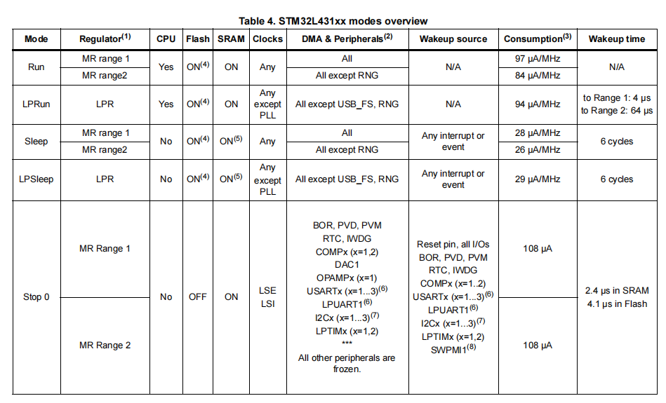

## 1 什么是MPU？我们为什么要使用MPU

MPU的全称是内存保护单元，主要作用是：

1. 代码访问保护

2. 内存保护

3. 外设保护

在stm32的F7系列和H7系列mpu中配置了Cache,这使得在这些高系列中要提高性能，会使用mpu变得十分的有必要。

## 2 简化的MPU框图及简介

从上面的图我们知道cpu与内存的通讯路线有三种：

- **strongely ordered memory（直接与内存通讯）**：程序完全按照代码顺序执行，CPU会等待当前加载存储执行完毕后才执行下一条指令，导致性能下降。
  
- **device memory（经过buffer再通讯）**：外设加载和存储要严格按照次序进行，确保寄存器按照正确顺序设置。

- **normal memory（经过cache再通讯）**：CPU以最高效的方式加载和存储字节、半字和字， CPU对于这种内存区的加载或存储不一定要按照程序代码的顺序执行。

它们的速度依次变大，normal memory 最快同时也是默认配置。

你可能会有疑问为什么这条看起来最慢的却是最快的，主要是因为cpu的读写速度比memory快得多得多，这样会导致出现cpu会停下来等待memory的情况，从而影响了它们间的通讯的速度，而在它们间加一个读写速度介于两者间的cache，用于储存高频使用的数据，让cpu和memory的数据不总是直接来自对方，从而提高两者通讯的速度。

## 3 Cache的命中（hit）与未命中（miss）

如果Cache刚好存储有cpu或memory的数据可以直接拿取叫做Cache的命中，反之就是miss未命中（叫未命中可能不太严谨，主要是想形象表达这个意思）。

## 4 CPU读写Cache

### 4.1 读命中

### 4.2 读未命中

读未命中有两种情况：

#### 4.2.1 read through（直接读）

#### 4.2.2 read allocate（读分配，即间接读）

### 4.3 写命中

写命中两种情况：

1. Write-through(直接写): 在数据更新时，把数据同时写入Cache和内存区。

    

2. Write-back(稍后写)：只有在数据被替换出缓存Cache时，被修改的缓存Cache数据才会 被写到后端存储。
    
    只有1，被替换成100，这时候1才会被写入到内存中。

    

### 4.4 写未命中

1. write allocate(写分配，即间接写)：先把要写的数据载入到Cache中，写Cache，然后再通过flush的方式写入到内存中。

    

2. no  write allocate(不间接写) ：并不将写入位置读入缓存，直接把要写的数据写入到内存中。

    

## 5 访问权限

特权级（Privileged）和非特权级（Unprivileged）主要由控制寄存器（CONTROL）中的 nPRIV位进行区分。

RTOS（实时操作系统） 通常让用户任务运行在 非特权模式，防止它们直接访问系统资源，而 RTOS 内核运行在 特权模式。

在 裸机开发 中，如果没有安全需求，一般默认运行在 特权模式。

- **MPU_REGION_NO_ACCESS**：无访问(特权级&用户级都不可访问)

- **MPU_REGION_PRIV_RW**：仅支持特权级读写访问

- **MPU_REGION_PRIV_RW_URO**：禁止用户写访问(特权可读写访问)

- **MPU_REGION_FULL_ACCESS**：全访问(特权级&用户级都可访问)

- **MPU_REGION_PRIV_RO**：仅支持特权读访问

- **MPU_REGION_PRIV_RO_URO**：只读(特权&用户都不可以写）

所以我们一般设置 `MPU_REGION_NO_ACCESS` 和 `MPU_REGION_FULL_ACCESS`。

## 6 MPU配置区域

STM32H7系列可以配置16个内存区域，0 - 15 优先级越来越大，优先级大的配置规则优先覆盖优先级低的规则。

一定要配置可访问背景，如果不设置可能出现各种莫名奇妙的错误。保护区大小一定要是32的整数倍。

因为Cash最小单位是32K，32 * 8 = 256KB

**什么是保护区子区？**

很简单上面说的16块region即16块保护区，每一块保护区又可分为8块子区。一般不使用。

## 7 配置策略

- 可缓存作用是开启Cache，加速CPU访问SRAM。

- 可缓冲的作用是开启Buffer，把CPU和Cache从较低的SRAM操作摆脱出来。

- 可共享的作用是解决master的数据同步。不要开启。

以下表对应 `TEX field level` 三个等级：

1. 一般不用Level 2（TEX = 2），也就是0b010

2. 性能最强Normal，TEX = 1, C = 1, B = 1, S = 0 是性能最强。（非共享性能最强）

3. 性能最弱Normal， TEX = 1， C = 0， B = 0， S = 1 是性能最弱Normal。

## 8 MPU配置总结

1. SCB_EnableICache() 和 SCB_EnableDCache 都是使能

2. 

### 8.1 DTCM和ITCM

TCM已经跟CPU主频一样，不需要做任何MPU配置，如果配置可能会出现各种奇葩问题。

### 8.2 内部Flash（0x800 0000）或者QSPI Flash

内部Flash可以直接使用默认配置，默认配置就是以下配置。

### 8.3 DM9000、以太网收发描述符

这一类都是需要设置为Device或者Strongly order执行方式的外设，此时读写Cache都是关闭的。

这类型好像共享开不开都无所谓。

**不支持非对齐访问，非对齐访问直接错误：**

### 8.4 

### 7.1 常用配置策略

## 参考

[参考1：初学stm32 --- 内存保护单元(MPU)](https://blog.csdn.net/gdragen_/article/details/144825756)

[参考2：STM32H743ZIT6+LWIP+MPU+CUBEMX，通过stm32cubemx完成初始化，ping包亲测没问题，带解释!!](https://blog.csdn.net/weixin_42434684/article/details/142214365)

[参考3：使用cubemx配置stm32h4750vb的mpu](https://blog.csdn.net/weixin_66689383/article/details/131993384)