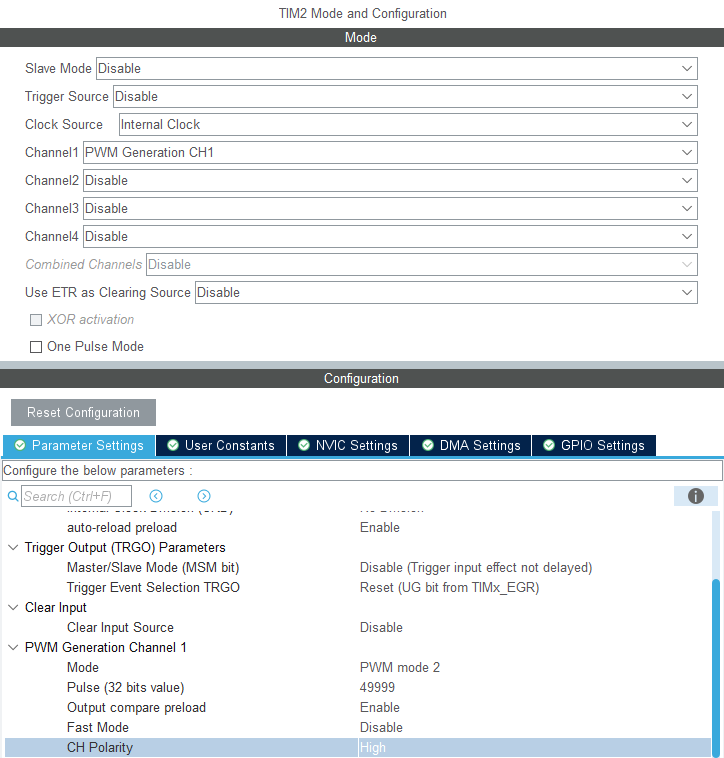
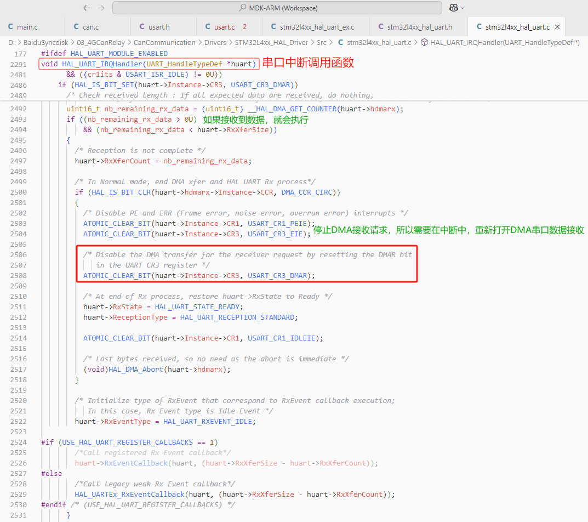
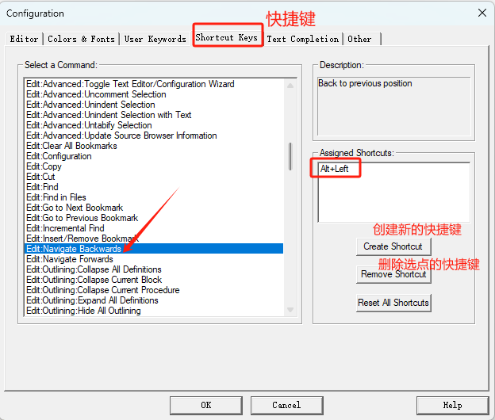
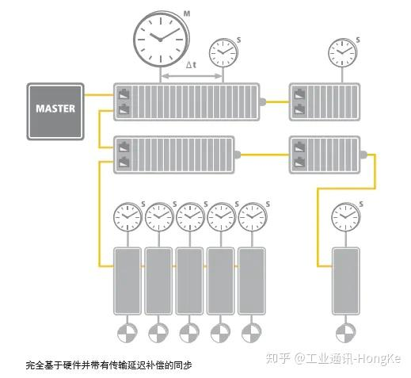

需要设置PWM2，级性为高。如果是PWM1，在更新中断停止PWM的时候，下一周期PWM已经开始运行，已经把高电平发出去了。所以通过中断函数判断发了多少脉冲，如果使用PWM1，会多发一个脉冲（不是一个完成的脉冲，但也会有高电平上升沿）。

## 1 基础

常见的加减速算法分析类型

1. 七段式S型曲线

2. 梯形曲线

3. Sigmoid函数型

## 2 梯形调速算法

为啥需要设计一个调速算法呢？步进电机不是给多少脉冲就动多少步吗？但是带上负载了就可能失步，所谓失步，简单理解就是实际电机轴转过的度数，没有输入脉冲对应度数多。为什么会这样呢？电机的扭矩有可能无法驱动负载。一般会做一个启动加速控制过程，停止的时候做一个减速控制，中间做一个匀速控制。这就是比较常见的梯形调速控制算法。

梯形速度调速算法很简单，比较容易实现，但是这个算法却有缺陷。

图中红色圆圈的位置，加速度从a突变为0，或从0突变为-a,这些突变点会带来什么后果呢？来看看其加速度曲线：

电机带着负载运动，比如常见的丝杆将电机的旋转运动，转化直线运动，又或者齿轮或滚珠结构，带动负载进行旋转运动。具有一定的质量的负载，在加速度突变情况下，很有可能会造成机械振动。

比较专业一点的术语称为 急动(Jerk) ，其实就是考察加速度的变化率的，也可以称为加加速度，我们知道速度的变化率就是加速度，而加速度的变化率就是加加速度。

如果用数学语言来装下逼，就是速度函数对时间的一阶导数就是加速度，而对加速度曲线的一阶导数就是加加速度。因此上图中加速度在时刻突变，意味着加加速度为无穷大。

对于给定的负载，加加速度越大，产生的不需要的振动能量就越大，振动能量的频谱也就越宽。这意味着加速度变化越快，振动就越强大，激发的振动模式数量也就越多。由于振动能量被系统机械吸收，如果振动频率与机械和控制系统中的共振相匹配，则可能会导致稳定时间增加或精度降低。

我们如果能做到加速度的变化率是连续的，是否这种变化就会变得平滑呢？运动是不是就更柔性？所谓变化率连续，是不是就是相对于加速度函数的导数曲线是连续的就可以了？

## 3 Sigmoid函数型

[参考： 步进电机加减速S曲线算法 - 让代码改变世界ha](https://www.cnblogs.com/builderx/p/15521659.html)

[参考: 步进电机S型曲线加速的实现](https://zhuanlan.zhihu.com/p/538605235)

[参考： 【STM32篇】步进电机之S型曲线](https://blog.csdn.net/we_long/article/details/129498376)

[参考： 步进电机S型曲线加减速算法与实现](https://blog.csdn.net/qq_20312079/article/details/113357176)

## 4 分段式S形速度规划算法

## 参考

[参考3： 自建S曲线数学模型（3次方程）](https://mp.weixin.qq.com/s/bhdvA3Ex6lAWVmBril-Sag)

