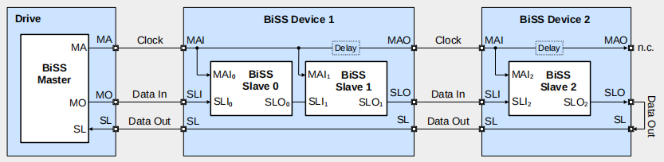

## 1 BISS协议概述

BISS（Bidirectional Synchronous Serial Interface）双向同步串行接口

BiSS由德国IC-HAUS公司开发，现已成为传感器通信协议的国际化标准。BiSS通信协议目前的版本是BISS-C。

BiSS通信协议是一种全双工同步串行总线通信协议，专门为满足实时、双向、高速的传感器通信而设计，在硬件上兼容工业标准SSI(同步串行接口协议)总线协议。

其典型应用是在运动控制领域实现伺服驱动器与编码器通信。

### 1.1 接口

通常BISS使用的接口方式有：

1. 长距离用标准RS422收发器速度一般高于10MHz。

2. 短距离用LVDS连接一般高于100MHz。（暂时没有接触过）

工业上一般使用是RS422收发器，如下：

### 1.2 BISS组网方式

BISS协议支持两种组网方式：点对点和总线连接。

点对点其实并不只能是一个从机，从机之间可以串起来。

1. RS422单个BISS从机的点对点连接。从机的数据输入引脚SLI在内部接地。上面图片的接口就没有SLI。主机的MO数据输出不使用。

    

2. RS422点对点菊花方式连接。

   

3. RS422总线连接方式。总线连接主机使用了MO接口。

    在总线连接方式中，主机在一个周期内完成与多个从机的通信，每一个从机有两个数据端口（一个输入SLI，一个输出SLO），从机首先通过 SLI接收上一个从机发送的数据链，然后把自身数据加入到数据链中，最后通过SLO发送到下一个从机。整个过程中由主机发出的时钟信号 MA 进行同步，在 MA 时钟同步下，主机通过 MO 差分线向从机发送数据，通过 SL 差分线接收从机数据链。

    

4. RS422总线连接中的菊花链。

       

### 1.3 BISS通信模式

无论那种连接方式下，BISS（C）都有两种工作模式：

- **传感器模式**：快速读取传感器数据，直接读取编码器位置数据和状态数据（错误、警告）。这是单向，主机通过MA时钟线，也能通知从机，进行读取数据。

- **寄存器模式**：主机和从机直接可以双向读写操作。也就是修改编码器内部的一些信息（比如校准数据等）。

### 1.4 BISS协议帧

BISS帧由四部分组成：idle、Header、Data channels、Timeout

- **IDLE**：由于BISS帧通常在有规律的周期内传输，所以会在周期结束后和下一帧开始前会有一个阶段。这个阶段称为空闲。通常情况下，空闲期间不传输数据，MAI和SLO引脚持续为高电平1。

- **HEADER**: 第一个上升沿（锁存LAT），传感器锁定当前数据。第二个上升沿（ACK）从机向主机确认新的BISS周期的开始，起始位（STR）表示BISS从机已准备好向BISS主机传输data。
              CDS暂且不明白具体作用，1可能表示从设备正在使用，不能传输数据。

- **DATA CHANNELS**：数据通道最多传输64位数据，每个数据通道最多16位校验。

- **TIMEOUT**：停止位（STP）后是CDM，CDM等于0是静态超时，等于1是自适应超时。

    

## 2 IC-MB4

