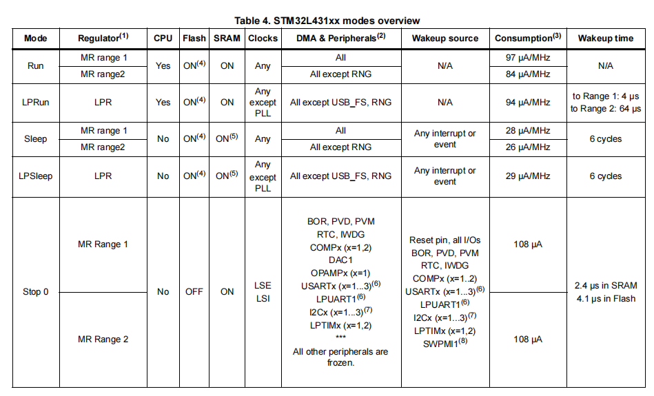

## 1 7种低功耗模式

STM32L4支持7种低功耗模式。

### 1.1 睡眠模式

睡眠模式下只有CPU停止工作，所有外设继续工作，任何中断或者事件都能唤醒CPU，此时约26uA/MHz。

### 1.2 LPRUN低功耗运行

低功耗运行模式Low-power run(LPRun)：这个模式下，CPU可以运行程序，但是跑的较慢，该模式可通过低功耗稳压器Low-Power Regulator为内核逻辑电路提供的电压工作来实现，显然降低工作电压可显著降低功耗。

### 1.3 停止模式

停止模式stop 0/1/2 mode： 停止模式可实现最低功耗，同时保留SRAM和寄存器的内容。由供电的所有时钟都停止运行，PLL，MSI RC，HSI16 RC和HSE晶体振荡器被禁用，但LSE或LSI时钟处于运行状态。

RTC可以保持运行状态（是通过软件配置可实现带RTC的停止模式，以及不带RTC的停止模式）。

**Stop模式的唤醒源**

1. 任意一个配置成EXTI中断的GPIO(上升沿/下降沿都可以)。
2. 外设事件（如 LPUART、I2C、SPI 配置为唤醒）。
3. RTC 定时器/闹钟/唤醒定时器。
4. LPTIM 定时器事件。
5. 某些内部事件（如 watchdog）。
  
**注意**：不能通过设置Wake Up唤醒，Wake Up唤醒只能是待机和关机模式。

### 1.4 待机和关机模式

只有通过5个Wake Up引脚IO，还有RTC时钟唤醒。

## 2 停止模式使用

关闭内核时钟、外设时钟，保留内核1.8V供电，寄存器和RAM中的数据可以保持，IO口状态也可保持；可以通过任意一个外部中断唤醒；唤醒后可回到停止的代码处向后执行，但要重新初始化时钟和外设。

https://blog.csdn.net/weixin_42328389/article/details/146957319

https://blog.csdn.net/weixin_43940932/article/details/119676935

https://blog.csdn.net/btzhy/article/details/148411906