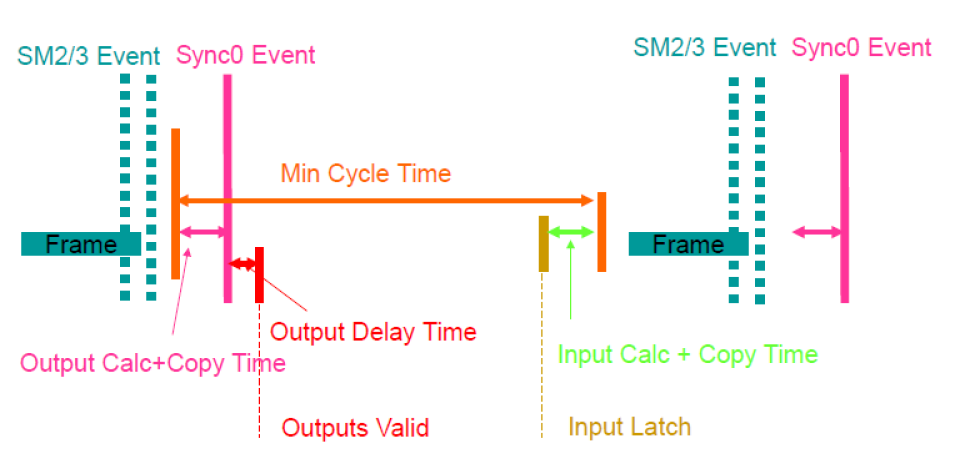
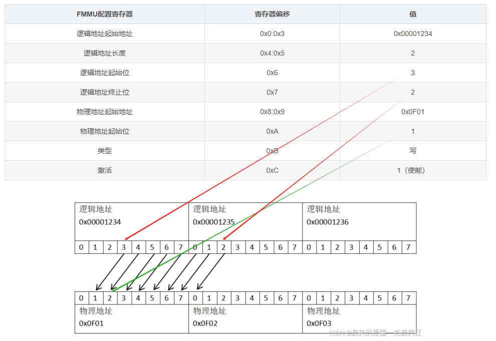
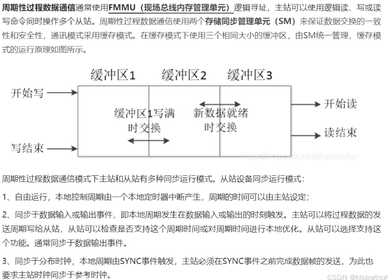
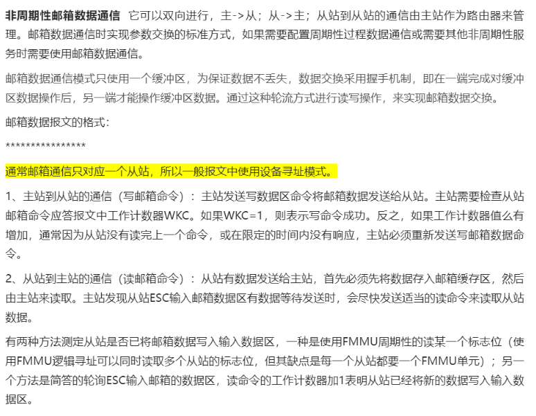

## 1 概述

- CAN只需要两根通信线（CAN_H、CAN_L），线路少，无需共地。

- 差分信号通信（利用两个信号的电压差值传递信息），抗干扰能力强。无需时钟线，通信速率由设备各自约定。

- 11位/29位报文ID，用于区分消息的功能，同时决定消息发送的优先级（ID号小的优先发送）。11位是标准帧、29位是扩展帧。

- 一个数据帧可配置 1 ~ 8字节的有效载荷（每次只能传输1~8字节数据）。

- CAN总线的两种标准：

  1. 高速CAN（ISO11898）：125K~1Mbps，<40m
   
  2. 低速CAN（ISO11519）：10K~125Kbps，<1Km

### 1.1 CAN协议硬件电路

CAN协议硬件电路有闭环CAN总线和开环CAN总线两种接法

高速CAN使用闭环网络，CAN_H和CAN_L两端添加120Ω的终端电阻，终端电阻可以防止回波反射，并在没有设备操作总线的情况下将两根通信线的电压维持在同一水平。（下面都以介绍高速CAN为主，除非有特殊说明）

低速CAN使用开环网络，CAN_H和CAN_L其中一端添加2.2kΩ的终端电阻，它们同样有防止回波反射的作用。

### 1.2 CAN协议帧格式

CAN协议规定了以下5种类型的帧：

#### 1.2.1 数据帧

- **SOF**：首先开始的是SOF(逻辑电平显性0，表示数据帧的开始)，总线被拉开。

- **ID**：然后紧接着就是11位的ID位，是用来区分当前发送数据帧设备的ID，范围就是 0x000 ~ 0x7FF

- **RTR**：用来区分数据帧和遥控帧，数据帧就是显性0，遥控帧就是显性1

- **IDE**：是扩展位，如果是显性0就表示标准帧格式，隐性1表示扩展格式

- **r0**：表示保留位

- **DLC**：表示的是后面数据的长度，DLC是4位，范围是0000 ~ 1111，最大就是64位，也就是8字节。

- **CRC**：校验段，当出现错误的时候这里基本上都会被发现的，然后驳回这个帧。

- **CRC界定符**：在进入ACK之前刚开始有一个CRC界定符，这时候发送方释放CAN总线，发送一个显性1（CRC界）作为起始标志，然后如果有接收方的话，接收方就会拿到总线，这时候接收方就会把总线给拉开使得为显性0（ACK槽），当此时发送方再次拿到总线的时候就会发现总线上变为显性1（ACK界）了，那么就说明有人接收了，所以发送完成。

- **EOF**：最后就是结束位EOF，长度为7位，均为隐性1。

**数据帧扩展格式**

CAN 2.0 时期， ID 不够用，出现了扩展格式，增加了 ID 的位数，为了区分标准格式与扩展格式，协议将标准格式中的 r1 赋予了新功能 IDE

#### 1.2.2 遥控帧（远程帧）

遥控帧无数据段， RTR 为隐性电平 1 ，其他部分与数据帧相同

#### 1.2.3 错误帧

总线上所有设备都会监督总线的数据，一旦发现“位错误”或“填充错误”或“ CRC 错误”或“格式错误”或“应答错误” ，这些设备便会发出错误帧来破坏数据，同时终止当前的发送设备

#### 1.2.4 过载帧

当接收方收到大量数据而无法处理时，其可以发出过载帧，延缓发送方的数据发送，以平衡总线负载，避免数据丢失

#### 1.2.5 帧间隔

将数据帧和遥控帧 与前面的帧分离开

## 2 CAN如何实现位时序与位同步

### 2.1 通过约定的波特率确定位时长
 
我们知道CAN总线是没有时钟线的，总线上的所有设备通过约定的波特率的方式确定每一个数据位的时长。

### 2.2 如何在一个位时间内正确采样获取数据

发送方以约定的位时长每隔固定时间输出一个数据位；接收方以约定的位时长每隔固定时间采样总线的电平，输入一个数据位。

`理想状态下`，接收方能依次采样到发送方发出的每个数据位，且采样点位于数据位中心附近。

但是，接收方以约定的位时长进行采样，但是采样点没有对齐数据位中心附近。

接收方刚开始采样正确，但是时钟有误差，随着误差积累，采样点逐渐偏离。

为了灵活调整每个采样点的位置，**使采样点对齐数据位中心附近**，CAN总线对每一个数据位的时长进行了更细的划分（即位时序），分为同步段（SS）、传播时间段（PTS）、相位缓冲段1（PBS1）和相位缓冲段2（PBS2），每个段又由若干个最小时间单位（Tq）构成，其中PBS1和PBS2的交界处即为采样点。

主要通过硬同步和再同步解决以上采样问题

## 2 STM32设置CAN波特率

### 2.1 波特率的设定

- 最小时间单位（Tq，Time Quantum）

- 同步段（SS，Synchronization Segment）1Tq

- 传播时间段（PTS，Propagation Time Segment）1-8Tq

- 相位缓冲段1（PBS1，Phase Buffer Segment1）1-8Tq

- 相位缓冲段2（PBS2，Phase Buffer Segment2）2-8Tq

- 再同步补偿宽度（SJW，reSynchronization Jump Width）1-4Tq

- 波特率分频器（BRP，Baud Rate Prescaler）

### 2.2 如何计算100K波特率

STM32中把传播时间段PTS和PBS1合并到了一起，形成了新的时间段1（BS1）

## 3 STM32过滤器

https://blog.51cto.com/u_16461249/9238952

https://blog.csdn.net/weixin_66275497/article/details/131901364

https://blog.csdn.net/m0_73640344/article/details/137885244

## 参考

[参考1：CAN总线-----帧格式](https://blog.csdn.net/m0_73633088/article/details/141143872)

[参考2：STM32入门教程（CAN通信篇）](https://blog.csdn.net/Zevalin/article/details/140638078)

[参考3：stm32：CAN通讯](https://blog.csdn.net/weixin_59669309/article/details/140498011)

[参考4：CAN总线波特率的设定——以STM32为例](https://blog.csdn.net/piaolingyekong/article/details/124276670)

https://rymcu.com/article/1633

https://blog.csdn.net/weixin_41226265/article/details/134094701

https://blog.csdn.net/AIshixian/article/details/144268568

https://blog.csdn.net/weixin_43362027/article/details/132716496