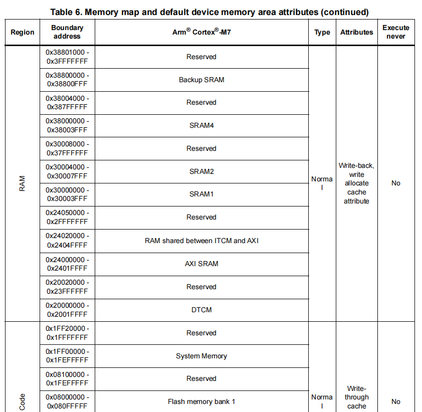
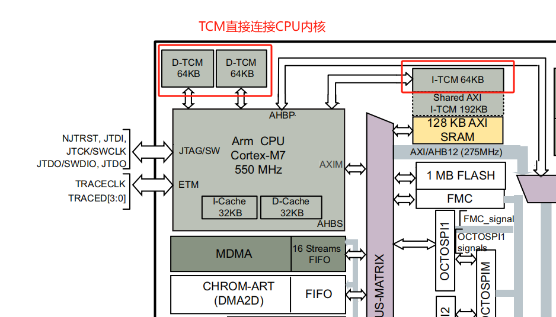
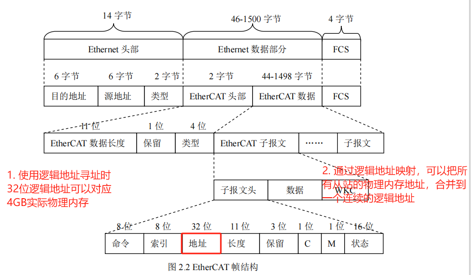

## 1 基本概念

### 1.1 操作系统的定义

一个通用操作系统提供的主要功能有（可见下图蓝色的部分）：

- 任务（应用程序）的调度管理（重要）

- 堆栈和内存管理（重要）

- 文件管理

- 队列管理

- 中断和定时器管理

- 资源管理

- 输入输出管理

### 1.2 实时性的含义

**实时操作系统**（RTOS-Real Time Operating System）中实时（Real Time）指的是任务（Task）或者说实现一个功能的线程（Thread）必须在给定的时间(Deadline)内完成。

`说明：Linux等操作系统一般把多任务都是称为多个线程，FreeRTOS中将线程称为任务。`

### 1.3 FreeRTOS介绍

FreeRTOS是一个迷你的实时操作系统内核。作为一个轻量级的操作系统，功能包括：任务管理、时间管理、信号量、消息队列、内存管理、记录功能、软件定时器、协程等，可基本满足较小系统的需要。由于RTOS需占用一定的系统资源(尤其是RAM资源)，只有μC/OS-II、embOS、salvo、FreeRTOS等少数实时操作系统能在小RAM单片机上运行。相对μC/OS-II、embOS等商业操作系统，FreeRTOS操作系统是完全免费的操作系统，具有源码公开、可移植、可裁减、调度策略灵活的特点，可以方便地移植到各种单片机上运行。

下图为FreeRTOS架构框图，一般情况也是只有基础内核。

学习FreeRTOS中，需要关注的概念：

1. 任务管理：任务和结构体、任务状态管理、任务切换（任务中调用任务切换、中断中调用任务切换、systick中断中的任务切换）

2. 通信机制：队列、队列集、流缓冲区、消息缓冲区、信号量和互斥锁、软件定时器、事件组和标志

## 2 手动系统移植

项目具体路径为：

[GitHub下载9.0版本的FreeRTOS](https://github.com/FreeRTOS/FreeRTOS/archive/refs/tags/V9.0.0.tar.gz)

### 2.1 拷贝FreeRTOS相关源码

在使用CubeMXSTM32F103RCT6创建项目后，在项目目录创建 `FreeRTOS` 文件夹，以及创建 `src` 和 `port` 子目录。

把 `D:\BaiduSyncdisk\FreeRTOS_Study\FreeRTOS-9.0.0\FreeRTOS\Source` 目录下面的 `include` 文件夹拷贝到 `D:\BaiduSyncdisk\FreeRTOS_Study\01_STM32F103RCT6_FreeRTOS_CopyFreeRTOS9.0Create\STM32F103RCT6_FreeRTOS\MDK-ARM\FreeRTOS` 目录下

把 `D:\BaiduSyncdisk\FreeRTOS_Study\FreeRTOS-9.0.0\FreeRTOS\Source` 目录下面的所有 `*.c` 文件，拷贝到 `D:\BaiduSyncdisk\FreeRTOS_Study\01_STM32F103RCT6_FreeRTOS_CopyFreeRTOS9.0Create\STM32F103RCT6_FreeRTOS\MDK-ARM\FreeRTOS\src` 目录下 

把 `Source/portable` 下的 `MemMang` 和 `RVDS` 文件夹拷贝到 `FreeRTOS/port` 下

### 2.2 源码添加到工程

1. 新建FreeRTOS/src和FreeRTOS/port组

2. FreeRTOS/src组中把FreeRTOS/src文件夹中的源文件全部添加

3. FreeRTOS/port组添加FreeRTOS\port\MemMang中的heap4.c和FreeRTOS\port\RVDS\ARM_CM3中的port.c

4. 添加头文件路径

5. 拷贝FreeRTOSv9.0.0\FreeRTOS\Demo\CORTEX_STM32F103_Keil下的FreeRTOSConfig.h文件到工程

## 参考

[参考1：FreeRTOS 从入门到精通 - 精华总结](https://zhuanlan.zhihu.com/p/443458699)

https://blog.csdn.net/Naisu_kun/article/details/125782481

https://www.freertos.org/zh-cn-cmn-s/Documentation/01-FreeRTOS-quick-start/01-Beginners-guide/01-RTOS-fundamentals

https://www.bmrtech.com/Tech/tech_show/461.html

https://blog.csdn.net/weixin_39087415/article/details/124514209

1.8.5 固件问题：

https://blog.csdn.net/qq_36955622/article/details/143448573