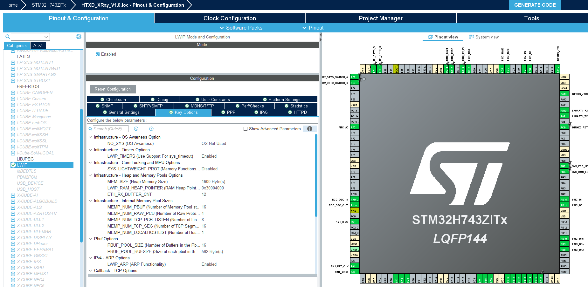

## 1 CubeMX生成Lwip



## 2 重要结构体对象

### 2.1 netif

lwIP协议栈支持多种不同的网络接口（网卡），由于网卡是直接和硬件平台打交道，硬件不同则处理也是不同的，所以由用户提供最底层的接口函数，lwIP提供统一的接口，但是底层的实现需要用户自己去完成（ethernetif.c）。

一个系统中可能有多个网络接口，有可能是以太网，有可能是WiFi，也有可能是其他的网络接口，在lwIP中每一个网卡都由一个netif结构体来表示，这些结构体描述了各个网卡的底层实现函数及状态，并以链表形式链接起来。

```c
/* filename: netif.h */

struct netif {

  struct netif *next;

  ip_addr_t ip_addr; /* ip地址 */ 
  ip_addr_t netmask; /* 子网掩码 */
  ip_addr_t gw; /* 网关地址 */

  /* 这个函数由网络设备驱动调用，用于将数据包传递给TCP/IP协议栈 */
  netif_input_fn input;

  /* 这个函数由IP层调用，用于发送数据给接口. 它首先解析硬件地址，然后发送数据包 */
  netif_output_fn output;

  ...
}

```


## 

nagle造成的无法立即发送

https://blog.csdn.net/qq_43448742/article/details/107314650

https://blog.csdn.net/weixin_39628271/article/details/111686643?spm=1001.2101.3001.6650.1&utm_medium=distribute.pc_relevant.none-task-blog-2%7Edefault%7EBlogCommendFromBaidu%7EPaidSort-1-111686643-blog-107314650.235%5Ev43%5Epc_blog_bottom_relevance_base2&depth_1-utm_source=distribute.pc_relevant.none-task-blog-2%7Edefault%7EBlogCommendFromBaidu%7EPaidSort-1-111686643-blog-107314650.235%5Ev43%5Epc_blog_bottom_relevance_base2&utm_relevant_index=2

https://blog.csdn.net/m0_56800366/article/details/143193781

## 参考

[参考1：Lwip协议netif结构体详解](https://blog.csdn.net/weixin_39270987/article/details/109210417)

[参考2：正点原子lwIP学习笔记——lwIP网络接口管理](https://zhuanlan.zhihu.com/p/656341352)


https://blog.csdn.net/hanchaoman/article/details/143503990


https://www.cnblogs.com/fuyunxiansen/p/18056391

https://blog.csdn.net/inputA/article/details/143462755

https://blog.csdn.net/qq_51679661/article/details/141425917

https://blog.csdn.net/lanzh_syf/article/details/140752478

https://blog.csdn.net/weixin_67846820/article/details/144157792

https://doc.embedfire.com/net/lwip/stm32/zh/latest/doc/chapter4/chapter4.html

https://blog.csdn.net/qq_38072731/article/details/144217772