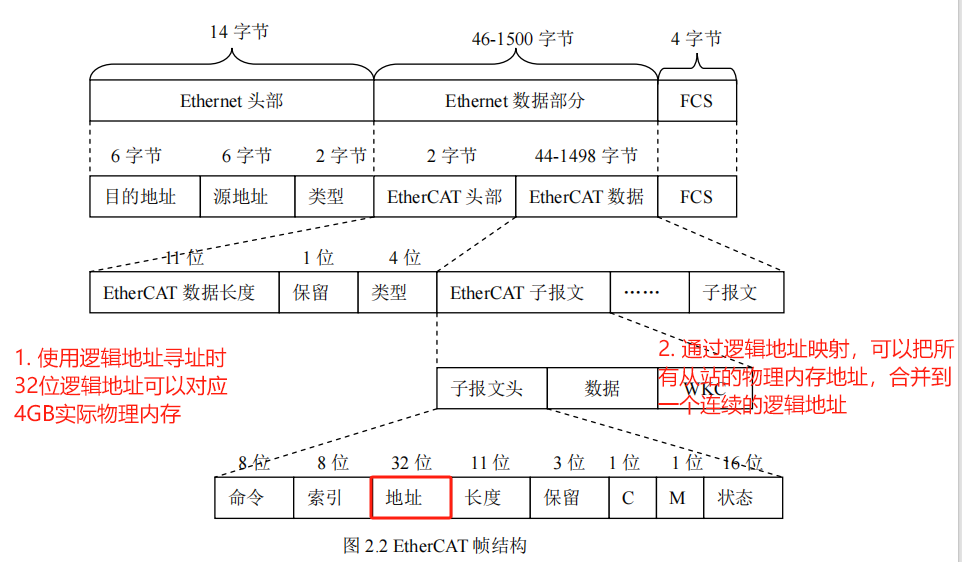
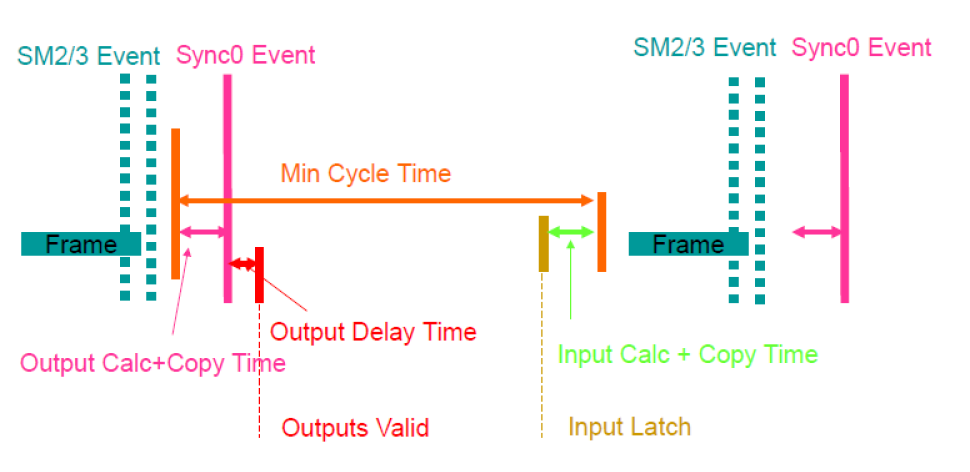

## 1 EtherCat概述

### 1.1 特性（可以简单看看）

1. 开发的技术：EtherCAT全称EtherNet Control Automation Technology，是由德国倍福（Beckhoff）公司提出的一种实时以太网技术。EtherCAT是一种开放但不开源的技术，意味着您可以任意使用这项技术，但若要进行相关设备的开发，则需要向倍福公司获取相关授权。

2. 快速性：相比传统现场总线，EtherCAT的数据传输速率有了极大的提升，可选10Mbit/s或100Mbit/s，甚至依托补充的EtherCAT G技术，传输速率可达1000Mbit/s；同时EtherCAT基于标准以太网帧传输，单帧数据用容量可达1486 Bytes。这使得在传输数据量方面EtherCAT有无比的优越性。

    

3. 拓扑的灵活性：EtherCAT几乎支持所有的拓扑结构：星型、线性、树型、菊花链型等，并支持各类电缆、光纤等多种通信介质，还支持热插拔特性，保证了各设备之间连接的灵活性。同时EtherCAT几乎没有设备容量限制，最大从站设备数可达65535个，使得网络中无需交换机的存在，仅通过设备间的拓扑结构即能使得EtherCAT数据直达每个从站。
   
      

4. 同步的精准性：对于像多个伺服轴执行协同运动等一类应用，其对数据同步性要求甚高。而EtherCAT可选择使用分布式时钟（DC）的方式同步节点，并采用完全基于硬件的时间校准机制，使得整个系统抖动时间远小于1us，能够完全适用于这样的应用之下。如下图所示，300个EtherCAT站点间的信号时间抖动仅有20ns：
      
      

5. 高可用性：EtherCAT可通过简单的措施实现线缆的冗余性。通过将网络中最后一个站点与主站设备中的以太网端口连接，即可将线型拓扑结构扩展为环型冗余拓扑结构。当线缆损坏或站点故障发生时，主站堆栈中的附加软件检测就会检测到，并立刻切到换冗余线路中运行，而各站点无需为此而改变，甚至不会意识到网络通信正在冗余线路中运行。
      
      

### 1.2 网络架构

EtherCat网络运行原理如下图所示。

以太网设备之间接收和发送标准的ISO/IEC8802-3**以太网数据帧**，这些从站可以直接处理接收到的**子报文**，并对这些报文进行相应的加工，例如**提取**某些数据或**插入**需要的用户数据，之后将加工之后的报文传输给**下一个**EtherCAT从站。

最后一个EtherCAT从站的功能则是发回经过完全处理的报文，并由第一个从站作为相应报文将其发送给控制单元。

每个从站的数据并非使用各自独立的以太网帧，而是把每个从站的以太网帧合并在一起。

这是因为etherCat网络采用的是中央调度机制，而不是独立竞争机制。

- 下行：主站可以通过一个以太网帧，同时控制多个从站设备，提升了系统的实时性。

- 上行：主站通过通过一个以太网帧，同时获取多个从站设备发来的数据，提升了系统的实时性。

## 2 ISO/OSI参考模型

EtherCAT网络只有物理层（PHL）、数据链路层（DLL）和应用层（APL）。

以太网协议就是数据链路层的协议

### 2.1 应用层协议

应用层协议分为多种类型：CoE， SoE，EoE, FoE。应用层是EtherCAT协议最高的功能层。应用层向上为应用程序提供服务，向下与网络接口通信。

#### 2.1.1 CoE (CANopen over EtherCAT)

- 将CANopen协议移植到EtherCAT上，用于配置和诊断。继承了CANopen的对象字典概念，便于设备参数的统一管理。

- 支持SDO（服务数据对象）和PDO（过程数据对象）通信。

- 常用于传感器、执行器等设备的实时数据交换和配置。

#### 2.1.2 SoE (Servo Drive Profile over EtherCAT)

- 专用于伺服驱动器控制的实时数据通信协议标准。

- 定义了伺服驱动器的控制和状态数据结构，包括速度、位置和电流控制等.

#### 2.1.3 FoE (File Access over EtherCAT)

- 提供文件传输服务，用于固件更新、配置文件传输等。

- 主要用于非实时数据传输，文件传输速率受限于EtherCAT的整体通信性能

#### 2.1.4 EoE (Ethernet over EtherCAT)

- 允许在EtherCAT网络上传输标准的以太网帧，实现EtherCAT与传统以太网设备的互联。

- 支持TCP/IP协议栈的通信，可以在EtherCAT网络中传输常规的以太网数据包。

#### 2.1.5 AoE (ADS over EtherCAT)

- 基于Beckhoff的ADS（Automation Device Specification）协议，实现不同控制系统之间的数据交换。

- 支持设备间的复杂数据通信和远程诊断

## 3 EtherCAT从站控制芯片

这一小节涉及到的内容，都是跟EtherCAT从站控制芯片相关的内容，也就是ESC芯片的主要功能：

1. 从站的微处理器（比如STM32）从ESC中读取数据，实现设备控制功能，并采样设备的反馈数据，将其写入ESC中，由主站读取。从站的应用程序是微处理器执行的，ESC负责的是读写总线数据。

2. ESC芯片内部有RAM空间，存储数据。双端口存储器DPRAM（最大64K字节，其中包括4K字节寄存器空间和1~60K字节的用户数据），DPRAM可以有外部微处理器使用并行或穿行数据总线访问，访问接口称为物理设备接口PDI。

3. ESC芯片具有FMMU逻辑地址映射功能，将逻辑地址与ESC内部RAM地址映射起来，从而实现多个从站的ESC内部RAM地址，可以映射到一个连续的逻辑地址。提供数据帧的利用率。

4. 主站和从站同时读写ESC芯片，存在数据安全性问题。由存储同步管理器SynManager(SM)管理DPRAM，保证数据一致性和安全性。

5. 具有EEPROM访问功能，存储ESC和应用配置参数（xml文件），定义从站信息接口（SII,Slave Information Interface）

### 3.1 FMMU

1. Fieldbus Memory Management Units（FMMU），通过内部的映射将逻辑地址转换为ESC内部实际的物理地址。在系统初始化阶段，主站会配置从站的FMMU模块（FMMU寄存器），为每个从站的物理地址分配一个唯一的逻辑地址。此后，主站访问从站寄存器（从站内存）时，不是直接访问从站的物理地址，而是访问这些逻辑地址。FMMU单元会自动将这些逻辑地址转换成对应的实际物理地址，从而实现数据的准确传输。

      映射举例：

      每个从站都会有FMMU配置寄存器，每个FMMU都有16字节的配置寄存器。现在将物理地址（实际内存地址） 0x0F01:1 - 0x0F02:0 映射至逻辑地址的 0x00001234:3 - 0x00001235:2，映射结果如下所示，逻辑地址长度是2，因为在映射的时候横跨了两个字节的长度。（只有指定了逻辑地址长度，才知道在哪里是映射结束。需要指定起始位，是因为有些IO状态，只需要1个位就可以表达清楚。

      

2. FMMU允许跨越多个从设备的数据段使用逻辑地址；一个数据报寻址几个任意分布的EtherCAT从站控制器内的数据。
    
   
   
   使用逻辑寻址的时候需要用到FMMU，我们在数据包头填写的地址就是这一包数据逻辑地址的起始地址。逻辑寻址时，如果本报数据中有逻辑地址与FMMU所配置的逻辑地址匹配，那么就会对FMMU逻辑地址所对应的物理地址进行操作。

   

3. FMMU支持的访问类型可以配置为只读、只写或读写，以满足不同应用场景的需求。

### 3.2 SM

当EtherCAT主站需要与从站的本地应用程序进行通信时，这种交互并非直接进行，而是必须通过EtherCAT从站控制器来实现。此时，从站控制器内的Sync Managers（同步管理器）便承担了管理这一通信功能的重任。

1. SyncManagers确保了EtherCAT主站与本地应用程序之间的数据交换既一致又安全。它们不仅管理数据的流动，还负责生成中断以通知双方数据的变化。这些SyncManagers由EtherCAT主站进行配置。

2. 在通信过程中，SyncManagers支持不同的通信方向和通信模式，如缓冲模式和邮箱模式，这些都可以根据应用需求进行配置。当使用缓冲模式时，SyncManagers利用位于内存区域的一个特定缓冲区来交换数据。这个缓冲区的访问受到SyncManagers的硬件控制，确保了数据访问的安全性和一致性。

3. 每个ESC可以有多个SM，一般是4个
   
    - SM0 ：用于输出邮箱（Mailbox Out，主站到从站）。
   
    - SM1 ：用于输入邮箱（Mailbox In，从站到主站）。
  
    - SM2 ：用于输出过程数据（Process Data Out，主站到从站）。
   
    - SM3 ：用于输入过程数据（Process Data In，从站到主站）。

根据通信方式，分为了非周期性的通信和周期性的通信。

#### 3.2.1 非周期性的通信

1. 非周期性通信使用的就是邮箱模式，通过同步管理器（SM）的邮箱通道（如SM0和SM1）进行传输。

2. 非实时性：SDO通信就是非周期性进行的，需要主站主动发起请求。

#### 3.2.2 周期性的通信

1. 周期性通信使用的就是缓冲模式，通过SM2、SM3进行传输。

2. 实时性：PDO通信就是周期性进行的。

## 4 

## 4 三种同步模式

### 4.1 Free Run模式

 1. 每个从站的定时周期都不一样
 
 2. 每个定时周期到的时候，每个从站去执行自己的程序，<比如检查通道上有没有合适的新的输入数据，有的话就令其输出有效(Output valid)或者检查有没有需要输入的数据，将其放到对应的同步管理器通道上(input prepare)让主站取走>
 
 3. 对于Free Run 模式而言，好比每个人都有自己的手表，但是如果没有一起对时的话。手表的本身的时间是不一样的(可能表和表之间存在时间差，一个8点一个10点)，那么在这种情况下，公司如果要求9点上班，那么每个人到公司的时间都是自己手表上的9点，但是不是统一的9点，他们到达公司的时间是不一样，所以Free Run模式没有任何的同步性可言

### 4.2 SM同步机制（Sync Manager同步管理器）

1. 一般而言，如果EtherCAT总线通讯时的同步模式不是DC模式，那么就是SM同步模式了

2. SM(Sync Manager同步管理器)指的是同步管理器的同步，它的触发方式是通过SM Event，也就是我们的数据帧在到达对应的从站的时候，会触发一个叫做同步管理器事件的信号(即SM Event)，当从站接受到这个信号的时候，会进入到对应的中断服务例程(即中断保存当期任务，去执行插入的中断例程，这里指线程中断处理相关数据，这也是SM Event和 Free Run的不同之处)，即SM是通过中断服务例程来处理对应的数据。

3. 从站检测到SM Event事件信号的时候会进入到中断服务例程去处理相应的数据(比如把输出数据有效，然后把输入数据放到同步管理器的通道上让主站取走)

4. 由于SM同步模式是根据数据帧到达特定从站的时候来触发SM Event事件信号来进行同步，那么对于一个特地给的帧来说，它到达每一个从站的时间必然是不同的，当系统很庞大的时候，每个从站接收到数据帧的时间就会相差很大，越在后边的从站接收到数据帧的时间就越晚，它的同步效果就越差。

5. 手表举例：10个人10个表，10个人开始对表，从0开始计时，当上一个人完成了对表计时之后，才通知到下一个人进行对表计时，依次传递，那么到最后的第10个人它开始计时的时间是最晚的。完成对时之后，如果公司要求是10点上班，每个人按照自己手表上的10点到达，那么第10个人一定是最晚的。

### 4.3 简单DC同步机制（Sync0 Event）

1. Sync0 Event和SM Event事件信号是类似的，他们都是一个中断事件信号，对于一个从站而言，如果中断信号触发了而且中断屏蔽寄存器没有屏蔽掉该中断信号，那么从站就会进入到中断服务例程

2. 中断服务例程就是说从站从主循环中跳出，暂停并保留主程序状态，然后执行中断服务例程这一部分内容，比如说周期性数据的输出<周期性数据的实时性比较强，那么中断信号可以满足这种比较强的实时性需求，不会因为其他信号来耽误它的操作，其它的中断信号会进入等待状态直到前一个中断信号被恢复，即进入到恢复现场阶段>

3. 不同于SM Event的地方是Sync0 Event是根据我们自己设定的延时时间触发而不是帧到达时候才触发

4. 注意，虽然简单DC同步机制中没有用到SM Event事件信号，但是它依旧是存在的，因为只要当Frame帧到达从站的时候就会触发SM Event事件信号，这里只是不用到该信号来进行触发而已，（但是应该明白不管是哪一种同步机制，SM Event都是存在的，当从站接受到数据帧的时候都会产生SM Event事件信号）

### 4.4 简单DC同步机制的时序分析

1. 除了Sync0 Event信号之外，还可以看到有一些其他的信号，包括Output Valid和Input latch信号，像这些信号都是TwinCAT主站在初期设置的时候可以设置的内容，Output Valid表输出有效，实际上是主站在Sync0 Event事件信号触发后的基础上作了一定的时间偏移

2. 偏移时间(Output Delay Time)是可以在TwinCAT上看到并且可以手动调整的

3. Input Latch的偏移时间也是在TwinCAT上可以调整的，所以说以上两部分内容都是可以灵活设置的

4. 手表举例：10个人10快手表，它们的时间在和参考时间对时之后，每个人的时间都是和参考时间同步，他们的时间是一样的，公司要求9点上班，那么他们按照各自的时间准时达到也是一致的。

### 4.5 DC同步机制优化

1. 优化的DC模式同时使用了SM Event事件信号和Sync0 Event事件信号，而简单DC同步机制只是使用Sync0 Event这一种事件信号进行同步，同样应该明确的是，无论使用哪一种同步模式，只要当数据帧Frame到达从站的时候都会触发对应的SM Event事件信号

2. 在这种优化的DC模式中，当对应的SM Event事件信号触发后，从站会进入到中断服务例程进行数据的处理《把数据帧Frame中对应的所需数据进行计算，然后复制到管理器通道对应的用户区域，等待Sync0 Event同步信号触发之后让从站取走，然后SM Event中断完成，恢复现场》，==然后等待Sync0 Event信号的触发到来，也就是同步信号的触发，可以看到由于之前SM Event中断中已经完成了前期数据的处理，当Sync0 Event同步信号触发时，程序进入到中断服务例程，就只需要很短的一段Output Delay Time，马上就进入到Output Valid(输出有效)状态。

3. 这种优化版的DC同步机制相对于之前的简单DC模式，优点就是Output Delay Time输出延时没有那么长了，主要是因为第二种优化的DC模式利用SM Event事件信号的触发完成了前期从数据帧中对应从站数据的计算和复制到管理器通道上，所以当Sync0 Event同步信号触发后，只需要从管理器通道取走已经计算并复制好了的数据，进入到输出有效Output Valid的延时时间自然就比较短了，而第一种简单的DC模式只是使用到了Sync0 Event同步信号，所以当Sync0 Event触发后，需要在Output Delay Time时间内完成数据的复制和计算，所以简单DC模式下的Output Delay Time延时时间就会比较长。

## 参考

[参考1：EtherCat从站 - EtherCAT协议栈与工作原理, 软硬件解决方案](https://blog.csdn.net/HiWangWenBing/article/details/131506688)

[参考2：EtherCAT协议基础知识(Part 1)](https://zhuanlan.zhihu.com/p/264356961)

[参考3：EtherCAT总线通信Freerun、SM、DC三种同步模式分析（分析了DC是如何同步）](https://cloud.tencent.com/developer/article/2088240)

[参考4：EtherCAT学习笔记](https://blog.csdn.net/qq_28149763/article/details/142770242)

https://www.cnblogs.com/tdyizhen1314/p/18316344

https://blog.csdn.net/qq_37659294/article/details/130137250

https://blog.csdn.net/weixin_46024116/article/details/135388025

https://blog.csdn.net/qq_28149763/article/details/142770242

https://infosys.beckhoff.com/english.php?content=../content/1033/tc3_io_intro/4981170059.html&id=

https://blog.csdn.net/zw_snake/article/details/146425622

https://blog.csdn.net/weixin_46024116/article/details/134957558

https://blog.csdn.net/qq_46211259/article/details/137949627

https://blog.csdn.net/g360250466/article/details/141144347

https://www.eefocus.com/article/1789901.html

https://www.cnblogs.com/young-dalong/p/14694179.html

https://blog.csdn.net/qq_37659294/article/details/130516286

