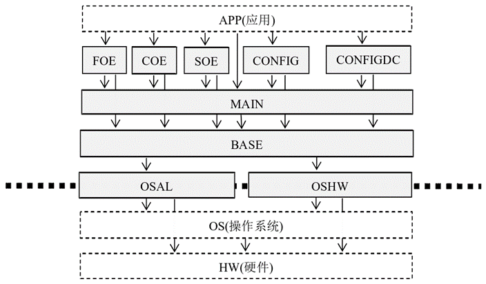

## 1 SOEM

[github SEOEM下载链接：https://github.com/OpenEtherCATsociety/SOEM](https://github.com/OpenEtherCATsociety/SOEM)

SOEM库采用分层设计，并且提供了一个抽象层，将SOEM协议栈与具体操作系统和硬件分开。抽象层由OSAL和OSHW两个模块组成，OSAL是操作系统抽象层，OSHW 是硬件抽象层，移植的主要内容就是对OSAL和OSHW具体API实现，在新的操作系统和硬件平台上的重写。

SOEM的层级架构如下图所示：

https://blog.csdn.net/cln512/article/details/110704584

https://blog.csdn.net/weixin_48501028/article/details/128835795

https://openethercatsociety.github.io/doc/soem/tutorial_8txt.html

https://www.liruan.net/215.html

## CiA402

https://zhuanlan.zhihu.com/p/713705053

https://blog.csdn.net/qq_46211259/article/details/142423849

https://www.cnblogs.com/tossorrow/p/18380990

