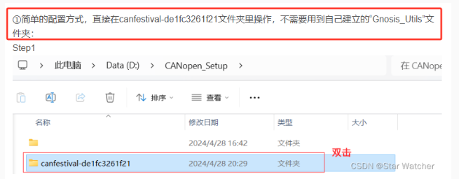
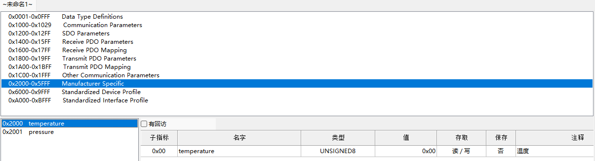
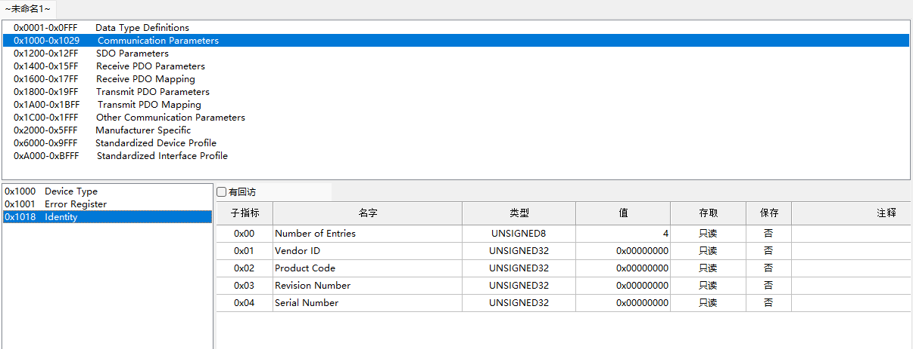
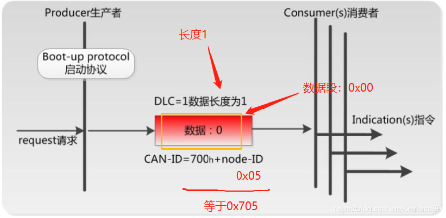

## 1 CANOpen概述

- **CANopen属于应用层协议**：从OSI的7层网络模型的角度来看，CAN现成总线仅仅定义了第1层（物理层）、第二层（数据链路层）。实际开发中，这两层完全是由硬件实现，设计人员无需再为此开发相关软件和固件。

  CANopen 是一个基于 CAN 串行总线的网络传输系统的应用层协议，遵循 ISO/OSI 标准模型。

- **CANopen面对对象设计**： 网络管理对象(NMT)、服务数据对象 (SDO)、过程数据对象(PDO)、 同步对象 (SYNC)、紧急报文 (EMCY)

- **CANopen定位为小网络、控制信号的实时通讯**： 所以报文采用的CAN标准帧格式，即11bit的ID，以尽量减小传输时间。

- **CANopen是主从模式通信**：并不是CAN的所有节点都允许自行发送报文，必须等主站发送，从站需要响应的时候，才能回复。

## 2 CANopen核心概念

### 2.1 CANopen帧格式定义




功能码就是用来定义：网络管理对象(NMT)、服务数据对象 (SDO)、过程数据对象(PDO)、 同步对象 (SYNC)、紧急报文 (EMCY)


### 2.2 CANopen对象字典

CANopen对象字典（OD: Object Dictionary）是CANopen协议最为核心的概念。

- 对象字典就是一个有序的对象组，描述了对应CANopen节点的所有参数。可以把节点看成一个对象，对象字典就是节点具有的属性。

- 从设备可以被另外设备（比如主设备）通过SDO修改对象字典属性对应的值。比如：修改从属节点的心跳发送频率。


对象字典的每一条，如何定义：

- 索引：对象的16位基址

- 子索引：8位

- 对象名称：制造商设备名称

- 对象代码：数组、变量或记录

- 数据类型：例如VISIBLE\u STRING、UNSIGNED32或记录名

- 访问：rw（读/写）、ro（只读）、wo（只读）

- 类别：表示该参数是否为必填/可选（M/O）

如表所示，为对象字典索引区域定义，其中<font color="green">标绿色底纹</font>的通讯对象子协议区和制造商特定子协议区是用户需要关注的区域。


#### 通信对象子协议区


## 3 网络管理（NMT控制）

- NMT报文是单向命令、从机不会直接应答NMT主站的指令。

- 但从机的状态变化可以通过心跳或节点守护机制发送到总线。

### 3.1 从机状态切换



节点状态切换的命令格式如下：

```sh
000（COB-ID） 02（数据位长度） 01（命令符） 00（节点地址，00表示所有节点）
```

状态切换的命令符定义如下：

- 0x01：进入操作状态

- 0x02：进入停止状态

- 0x80：进入预操作状态

- 0x81：复位应用层

- 0x82：复位节点通讯



可以通过查看心跳帧，确定从机处于那种状态。

#### 3.1.1 示例：所有节点进入操作状态

让CAN总线上所有节点进入操作状态。发送的CAN报文格式如下：


#### 3.1.1 示例：所有某个节点进入操作状态

让某个节点进入操作状态，发送的CAN报文格式如下：


### 3.2 心跳

心跳帧的格式如下：

```sh
0x705（COB-ID，节点5） 0x01（数据位长度） 0x05（表示进入操作状态）
```

以下是心跳帧的一字节数据对应的含义：

```c
//CanFestival-3.0-rc3\include\states.h
enum enum_nodeState {
  Initialisation  = 0x00, 
  Disconnected    = 0x01,
  Connecting      = 0x02,
  Preparing       = 0x02,
  Stopped         = 0x04, /* 停止状态 */
  Operational     = 0x05, /* 操作状态 */
  Pre_operational = 0x7F, /* 预操作状态 */
  Unknown_state   = 0x0F
};
```


### 3.3 节点上线


#### 3.3.1 节点上线示例


符合CANopen对NMT节点上线报文的定义：CAN-ID = 0x700 + node-ID(0x05 = 0x705，然后长度01，接着数据段是0。




## 参考

[参考2：CANopen | 网络管理NMT02 - 节点状态切换命令](https://blog.csdn.net/wallace89/article/details/119930578)

[参考3：CANopen | 网络管理NMT01 - 节点上线报文与心跳报文](https://blog.csdn.net/wallace89/article/details/119190718)