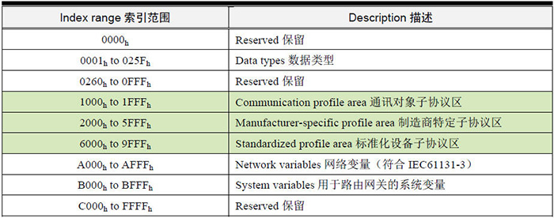
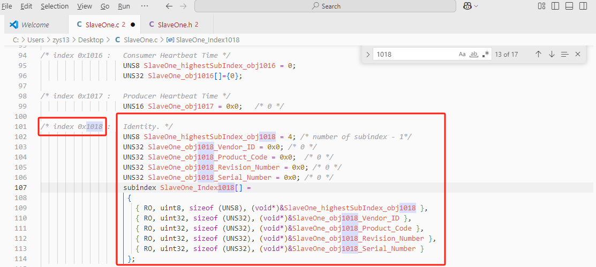
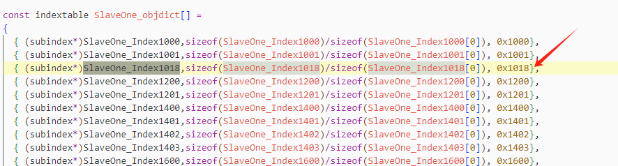

## 1 CANOpen概述

- **CANopen属于应用层协议**：从OSI的7层网络模型的角度来看，CAN现成总线仅仅定义了第1层（物理层）、第二层（数据链路层）。实际开发中，这两层完全是由硬件实现，设计人员无需再为此开发相关软件和固件。

  CANopen 是一个基于 CAN 串行总线的网络传输系统的应用层协议，遵循 ISO/OSI 标准模型。

- **CANopen面对对象设计**： 网络管理对象(NMT)、服务数据对象 (SDO)、过程数据对象(PDO)、 同步对象 (SYNC)、紧急报文 (EMCY)

- **CANopen定位为小网络、控制信号的实时通讯**： 所以报文采用的CAN标准帧格式，即11bit的ID，以尽量减小传输时间。

- **CANopen是主从模式通信**：并不是CAN的所有节点都允许自行发送报文，必须等主站发送，从站需要响应的时候，才能回复。

## 2 CANopen的预定义报文ID

功能码就是用来定义：网络管理对象(NMT)、服务数据对象 (SDO)、过程数据对象(PDO)、 同步对象 (SYNC)、紧急报文 (EMCY)

## 3 网络管理（NMT控制）

虽然 CANopen 的通讯发挥了 CAN 的特色，所有节点通信地位平等，运行时允许自行
发送报文，但 CANopen 网络为了稳定可靠可控，都需要设置一个网络管理主机 NMT-Master
（Network Management-Master），就像一个交响乐团的指挥家，所有节点的启动、停止都是
有他进行指挥。

## 4 对象字典OD

https://www.zhihu.com/question/339390871/answer/3270407247

https://my.oschina.net/emacs_8985206/blog/17783412

https://blog.csdn.net/zhaodong1102/article/details/126333839

https://shequ.stmicroelectronics.cn/thread-618656-1-1.html

https://zhuanlan.zhihu.com/p/1000809233

https://www.zlg.cn/data/upload/software/Can/CANopen_easy_begin.pdf

