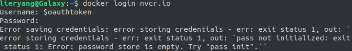

## 1 什么是NVIDIA TAO工具套件

NVIDIA TAO工具套件基于TensorFlow和PyTorch构建，是NVIDIA TAO框架的低代码版本的AI框架，便于非专业人士训练模型。

## 2 开始使用

下载包含启动脚本、Jupyter notebooks和配置文件的TAO软件包。TAO支持在Google Colab上使用；如果你想在Colab上尝试，可以跳过这一步，直接滚动到下面的在colab中运行部分。

```sh
wget --content-disposition https://api.ngc.nvidia.com/v2/resources/nvidia/tao/tao-getting-started/versions/5.1.0/zip -O getting_started_v5.1.0.zip
unzip -u getting_started_v5.1.0.zip  -d ./getting_started_v5.1.0 && rm -rf getting_started_v5.1.0.zip && cd ./getting_started_v5.1.0
```

### 2.1 文件层级和概览

TAO工具包的入门资源大致分为两部分。

- **setup**：这些是一组快速启动脚本，用于帮助安装和部署TAO工具包启动器和各种云服务提供商中的TAO工具包API。

- **notebooks**：这些是面向初学者的端到端教程notebooks，帮助您快速上手TAO。这些notebooks安装TAO，下载所需数据，并对各种用例执行TAO命令。

    这些notebooks大致分为以下3类。

    - tao_api_starter_kit：这些是端到端的notebooks，帮助您了解TAO工具包API执行模式支持的功能。api目录下的notebooks直接在REST API级别使用REST API请求工作，而client目录使用TAO客户端CLI与API服务器交互。

    - tao_launcher_starter_kit：该目录包括示例notebooks，指导您完成TAO工具包支持的所有计算机视觉模型的端到端工作流程。您可以使用TAO工具包启动器CLI与工具包交互。

    - tao_data_services：该目录包括示例notebooks，指导您完成TAO工具包中包含的不同数据集操作和注释工具的端到端工作流程。


```sh
setup

   |--> quickstart_launcher.sh # TAO Toolkit launcher CLI
   |--> quickstart_api_bare_metal # TAO Toolkit API
   |--> quickstart_api_aws_eks
   |--> quickstart_api_azure_aks
   |--> quickstart_api_gcp_gke

notebooks

   |--> tao_api_starter_kit

      |--> api

            |--> automl
            |--> end2end
            |--> dataset_prepare

      |--> client

            |--> automl
            |--> end2end
            |--> dataset_prepare

   |--> tao_launcher_starter_kit

      |--> dino
      |--> deformable_detr
      |--> classification_pyt
      |--> ocdnet
      |-->  ...

   |--> tao_data_services

      |--> data
      |-->  ...
```

## 3 运行TAO工具包：
TAO工具包以Docker容器或一系列Python轮子的形式提供。您可以通过以下方式之一运行TAO工具包：

- 3.1 Launcher CLI

- 3.2 直接使用容器

- 3.3 TAO工具包APIs

- 3.4 Python轮子

### 3.1 Launcher CLI

TAO工具包启动器是一个基于Python的轻量级命令行界面。启动器作为建立在PyTorch和TensorFlow之上的TAO工具包容器的前端。CLI让您不需要知道哪个网络在哪个容器中实现。根据您计划使用的模型，相应的容器会自动启动。

要开始使用启动器，请按照以下说明安装所需的前提软件。

#### 3.1.1 Installing the Pre-requisites

TAO工具包启动器严格是一个只支持Python3的软件包，能够在Python版本>= 3.7上运行。

1. 按照官方说明安装[docker-ce](https://docs.docker.com/engine/install/)(可以参考我Docker部分文章进行安装)。

安装了docker-ce后，按照安装后步骤确保Docker可以无需sudo即可运行。

```sh
# 确保Docker可以无需sudo运行
sudo addgroup --system docker
sudo adduser $USER docker && newgrp docker
sudo groupadd docker && sudo usermod -aG docker $USER
```

2. 按照安装指南安装[nvidia-container-toolkit](https://docs.nvidia.com/datacenter/cloud-native/container-toolkit/latest/install-guide.html)

```sh
# 1 安装 nvidia-container-toolkit
curl -fsSL https://nvidia.github.io/libnvidia-container/gpgkey | sudo gpg --dearmor -o /usr/share/keyrings/nvidia-container-toolkit-keyring.gpg \
  && curl -s -L https://nvidia.github.io/libnvidia-container/stable/deb/nvidia-container-toolkit.list | \
    sed 's#deb https://#deb [signed-by=/usr/share/keyrings/nvidia-container-toolkit-keyring.gpg] https://#g' | \
    sudo tee /etc/apt/sources.list.d/nvidia-container-toolkit.list
sudo apt-get update && sudo apt-get install -y nvidia-container-toolkit
# 2 配置
sudo nvidia-ctk runtime configure --runtime=docker
sudo systemctl restart docker
## 不知道是不是只配置docker就可以
sudo nvidia-ctk runtime configure --runtime=containerd
sudo systemctl restart containerd
```

3. 获取[NGC账户和API密钥](https://catalog.ngc.nvidia.com/?filters=&orderBy=weightPopularDESC&query=)：

    点击右上角 Setup -> Generate API Key


4. 命令行使用 `docker login nvcr.io` 登录 `NGC`

    **错误error storing credentials**



[解放方案：docker login失败：err: exit status 1, Try “pass init“](https://blog.csdn.net/level_code/article/details/125309779)

5. 使用Python >= 3.7配置Python环境

[miniconda安装参考](https://zhuanlan.zhihu.com/p/620155655)

```sh
# 安装conda
wget https://repo.anaconda.com/miniconda/Miniconda3-latest-Linux-x86_64.sh
bash ./Miniconda3-latest-Linux-x86_64.sh
source ~/.bashrc # 一定要更新，因为conda路径刚被添加到 .bashrc 文件中
# 使用conda安装python3.7
conda create -n launcher python=3.7
# 激活conda环境
conda activate launcher
# 关闭conda环境 conda activate launcher
```

注意看最前面的 `base` 和 `launcher`


#### 3.1.2 安装TAO Launcher

```sh
bash setup/quickstart_launcher.sh --install
tao --help
```

### 3.2 Running from Container

您可以直接使用 Docker 容器来运行 TAO。要直接使用容器，您需要知道要拉取哪个容器。在 TAO 下有多个容器，根据您想要训练的模型，您必须拉取适当的容器。在使用 Launcher CLI 时，这不是必需的。

```sh
export DOCKER_REGISTRY="nvcr.io"
export DOCKER_NAME="nvidia/tao/tao-toolkit"
export DOCKER_TAG="5.0.0-tf1.15.5" ## for TensorFlow docker
export DOCKER_CONTAINER=$DOCKER_REGISTRY/$DOCKER_NAME:$DOCKER_TAG

docker run -it --rm --gpus all -v /path/in/host:/path/in/docker $DOCKER_CONTAINER \
       detectnet_v2 train -e /path/to/experiment/spec.txt -r /path/to/results/dir -k $KEY --gpus 4
```

有关如何直接从容器运行的详细说明，请参考此部分。

### 3.3 Running TAO Toolkit APIs

TAO Toolkit API 是一个 Kubernetes 服务，通过 REST API 实现构建端到端的 AI 模型。可以使用 Helm chart 将 API 服务安装在 Kubernetes 集群（本地/AWS EKS）上，同时有最小的依赖关系。TAO Toolkit 作业可以利用集群上可用的 GPU 运行，并可以扩展到多节点设置。您可以使用 TAO 客户端 CLI 远程与 TAO 服务交互，或者可以直接使用 REST API 将其集成到您的应用程序和服务中。

要开始使用，请使用提供的一键部署脚本在裸机设置或托管的 Kubernetes 服务（如Amazon EKS）上部署。使用 Jupyter Notebooks 直接使用 API 进行训练，或使用客户端应用程序提供在 notebooks/api_starter_kit 下。

```sh
bash setup/quickstart_api_bare_metal
bash setup/quickstart_api_aws_eks
```

有关设置 API 服务和 API 的更多信息，请参阅此处。

### 3.4 Running from Python Wheels

您还可以在没有 Docker 或 K8s 的裸机上直接运行 TAO，使用 Python Wheels。TAO Toolkit 提供了在 Google Colab 上直接部署而无需配置基础设施的示例教程。有关如何使用 Google Colab 进行操作的完整说明，请参见此处。

## 4 Run Sample Jupyter Notebooks


运行示例 Jupyter Notebooks：

作为 TAO Toolkit 包的一部分，针对 TAO 支持的所有任务都提供了示例 Jupyter Notebooks。这些 Notebooks 广泛涵盖以下步骤：

1. 为 TAO 设置本地环境。
2. 安装 TAO Toolkit Launcher CLI。
3. 下载数据集和预训练模型。
4. 运行计算机视觉任务的端到端工作流程。下面的表格中提供了对 Notebook 的简要描述。

### 4.1 计算机视觉：

所有计算机视觉示例都包含在 NGC 上的入门资源中。

#### 4.1.1 专用预训练模型：

以下是专用预训练模型的列表，与其相应的示例有映射关系。

## 5 下载模型

TAO Toolkit Docker 为您提供了访问预训练模型仓库的权限，这些模型可以在训练深度神经网络时作为起点。这些模型托管在 NGC 上。要下载这些模型，请按照以下步骤操作：

1. 下载 NGC CLI 并进行安装。有关 NGC Catalog CLI 的更多信息，请参考此处。

2. 按照下面的说明配置 NGC CLI 并下载模型。

### 5.1 列出所有可用的模型

使用以下命令获取托管在 NGC 模型注册表中的模型列表：


https://catalog.ngc.nvidia.com/orgs/nvidia/teams/tao/resources/cv_samples/version/v1.4.1/files/yolo_v4/yolo_v4.ipynb


https://catalog.ngc.nvidia.com/orgs/nvidia/teams/tao/resources/cv_samples/files


https://www.hogking.cn/article/2022/10/17/4.html

https://developer.nvidia.com/blog/training-optimizing-2d-pose-estimation-model-with-tao-toolkit-part-1

https://docs.ngc.nvidia.com/cli/cmd.html

https://docs.nvidia.com/tao/tao-toolkit/text/data_annotation_format.html#id2

## 参考

[参考1： TAO Toolkit Quick Start Guide](https://docs.nvidia.com/tao/tao-toolkit/text/tao_toolkit_quick_start_guide.html)

[参考2：使用 NVIDIA TAO Toolkit 5.0 体验最新的视觉 AI 模型开发工作流程](https://zhuanlan.zhihu.com/p/647126254?utm_id=0)

[参考3：什么是TAO以及如何安装和使用TAO](https://blog.csdn.net/xccccz/article/details/122736853)