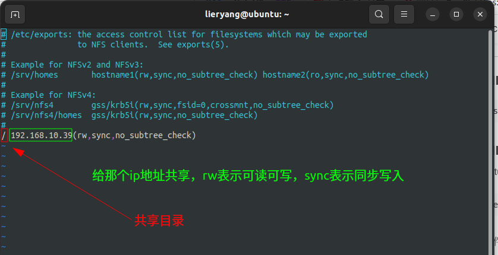

## 1 基本概念

**网络文件系统**（英语：Network File System，缩写作 NFS）是一种分布式文件系统，力求客户端主机可以访问服务器端文件，并且其过程与访问本地存储时一样，它由Sun Microsystems（已被甲骨文公司收购）开发，于1984年发布。NFS 的实现基于 ONC RPC（一个开放、标准的RFC系统，任何人或组织都可以依据标准实现它）。

## 2 安装相关服务

```sh
sudo apt-get -y  install nfs-kernel-server nfs-common
```

## 3 配置NFS服务

```sh
sudo gedit /etc/exports
```



## 4 重启NFS服务

```sh
systemctl enable nfs-kernel-server
systemctl restart nfs-kernel-server
```

## 5 主机查看服务器可共享目录


## 6 挂载NFS目录到本地

```sh
# 挂载
sudo mount -t nfs 192.168.10.195:/ /mnt/jetson_rootsys

# 取消挂载
sudo umount /mnt/jetson_rootsys
```