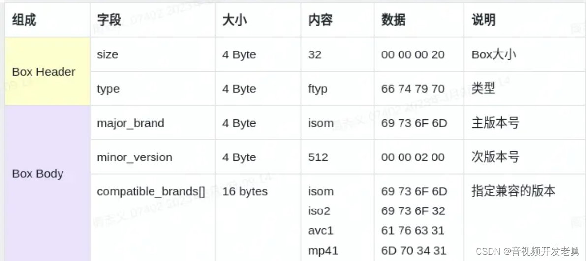
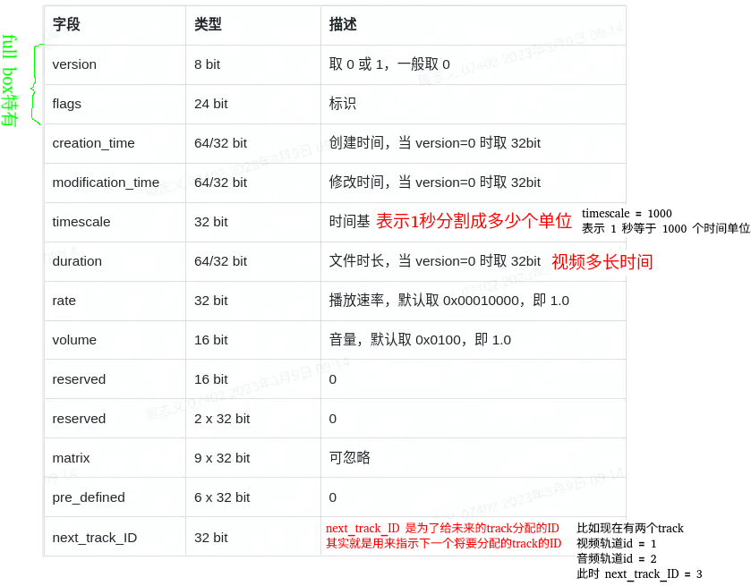

H.264码流中没有音频、没有时间戳、除了图像本身信息啥都没有。（没有时间戳，不能正常播放）

mp4 mkv 这些容器加时间戳

VCL层是对核心算法引擎、块、宏块及片的语法级别的定义，最终输出压缩编码后的数据 SODB。VCL数据在传输或存储之前，先被映射或封装进NAL单元中。NAL层将SODB打包成RBSP然后加上NAL头，组成一个NALU（NAL单元）。NAL层定义片级以上的语法级别（如序列参数集和图像参数集，针对网络传输），同时支持以下功能：独立片解码，起始码唯一保证，SEI以及流格式编码数据传送。

H.264标准中，视频流由NAL（NetWork Abstraction Layer）单元组成的（NALU），每个NALU中可能是IDR图像、非IDR图像、SPS或者PPS等。

## 1 基本概念

- NALU：Network Abstraction Layer Unit 网络抽象层单元

- VCL（VideoCoding Layer，视频编码层）：负责高效的视频内容表示。

- NAL（NetWorkAbstraction Layer，网络提取层）：负责以网络所要求的恰当方式对数据进行打包和发送。

- SODB（String of Data Bits，数据比特串）：最原始的编码数据，即VCL数据，没有任何附加数据。

- RBSP（Raw Byte Sequence Payload，原始字节序列载荷）：在SODB的后面填加了结尾比特（RBSP trailing bits），一个bit“1”（表示结尾），若干bit “0”（填充），以便字节对齐；

- EBSP （Encapsulation Byte Sequence Packets，扩展字节序列载荷）：在RBSP基础上填加了仿校验字节（0X03）。它的原因是：在NALU加到Annexb上时，需要添加每组NALU之前的开始码StartCodePrefix，如果该NALU对应的slice为一帧的开始则用4位字节表示，ox00000001，否则用3位字节表示ox000001（是一帧的一部分）。解码器检测每个起始码，作为一个NAL的起始标识，当检测到下一个起始码时，当前NAL结束。对于NAL中数据出现0x000001或0x000000时，H.264引入了防止竞争机制，如果编码器遇到两个字节连续为0，就插入一个字节的0x03。解码时将0x03去掉，也称为脱壳操作。

- SPS（Sequence Parameter Sets，序列参数集）：作用于一系列连续的编码图像。

- PPS(Picture Parameter Set，图像参数集)：作用于编码视频序列中一个或多个独立的图像。

- SEI(Supplemental enhancement information，附加增强信息)：包含了视频画面定时等信息，一般放在主编码图像数据之前，在某些应用中，它可以被省略掉。

- IDR(Instantaneous Decoding Refresh，即时解码刷新)：

- HRD(Hypothetical Reference Decoder，假想码流调度器)：

### 1.1 序列参数集SPS

SPS（Sequence Parameter Set，序列参数集）是一个关键的结构，用于存储一系列编码器的设置，这些设置在整个视频序列（或多个序列）中是恒定的。SPS包含了描述视频序列特性的信息，对于解码器正确解码视频至关重要。以下是SPS的主要作用：

1. 图像尺寸（宽度和高度）

2. 帧速率 

3. 指定了编码器所使用的Profile（如Baseline、Main、High等）和Level（如1.0, 2.1, 4.0等）。这些参数定义了编码器支持的功能和限制（如最大分辨率、最大比特率等）。

4. 最大参考帧数量、宏块尺寸等。

### 1.2 图像参数集PPS

PPS（Picture Parameter Set，图像参数集）是与SPS（序列参数集）同样重要的结构。PPS包含了一些与解码特定图像（或一组图像）相关的参数，这些参数通常在整个视频序列中保持不变，或者在需要时更新。PPS与SPS一起，为解码器提供了解码视频流所需的必要信息。以下是PPS的具体作用：

1. PPS包含了应用于单个图像或一组图像（例如，某个GOP中的所有图像）的编码参数。这些参数用于指导解码器如何处理和解码这些图像。

2. PS定义了用于图像的熵编码模式，包括CAVLC（Context-Adaptive Variable Length Coding）和CABAC（Context-Adaptive Binary Arithmetic Coding）。这些模式影响压缩效率和解码复杂度。

### 1.3 SODB和RBSP关系

SODB（String Of Data Bits）是原始编码数据，也就是SODB是由VCL生成的、最核心的编码数据位序列。这些比特流可能是不等长的，不一定是 8 的倍数。

 RBSP（Raw Byte Sequence Payload）是在 SODB 的基础上形成的，它在 SODB 的末尾添加了结尾比特（RBSP trailing bits），以确保字节对齐。

具体来说，RBSP 的结尾比特是一个比特的“1”，然后可能会填充一些比特“0”，直到 RBSP 的长度是 8 的倍数为止。这样做的目的是为了保证 RBSP 的字节对齐性，以便于在传输和存储时的处理。

## 1 AVCC与Annex-B标准

H.264码流分为AVCC（Advanced Video Coding Configuration）与Annex-B两种组织格式。两种不同的方式分割NALU单元

- AVCC格式 也叫AVC1格式，MPEG-4格式，字节对齐，因此也叫 Byte-Stream Format。用于mp4/flv/mkv等封装中。 

- Annex-B格式 也叫MPEG-2 transport stream format格式（ts格式）, ElementaryStream格式。用于TS流中（以及使用TS作为切片的hls格式中）。

这两种格式的区别有两点： 

1. NALU的分割方式不同； 

2. SPS/PPS的数据结构不同。

   - AVCC格式使用NALU长度（固定字节，字节数由extradata中的信息给定）进行分割，在封装文件或者直播流的头部包含extradata信息（非NALU），extradata中包含NALU长度的字节数以及SPS/PPS信息。

   - Annex-B格式使用start code进行分割，start code为0x000001或0x00000001，SPS/PPS作为一般NALU单元以start code作为分隔符的方式放在文件或者直播流的头部。

下图是 `Annex-B` 格式 H.264码流

## 1 

https://cloud.tencent.cn/developer/article/2320127

## 参考

### AVCC参考

[参考1：H264/H265的两种格式Annex B、AVCC(H264)/HVCC(H265)](https://blog.csdn.net/weixin_43147845/article/details/137011573)

[参考2：H.264流媒体协议格式中的Annex B格式和AVCC格式深度解析](https://cloud.tencent.com/developer/article/2320128)

### AUD参考

[参考：H264的RBSP类型之AUD](https://blog.51cto.com/u_13316945/5831964)

## 二进制文件分析软件

Ghex