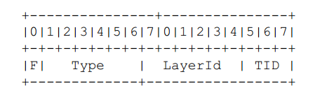

## 1 SPS基本概念

SPS（Sequence Paramater Set）又称作序列参数集。对应的是针对一段连续编码视频序列的参数。包含 帧数、POC的约束、参考帧数目、解码图像尺寸和帧场编码模式选择标识等信息。

1. SPS NALU的 `nal_unit_type` 为 7.

2. 可以获取到视频流的帧率、长宽。

3. 通过 `pic_order_cnt_type` 可以知道帧显示POC如何计算。

### 1.1 SPS每个字段含义

#### 1.1.1 profile_idc

标识当前H.264码流的profile。我们知道，H.264中定义了三种常用的档次profile：

基准档次：baseline profile;

主要档次：main profile;

扩展档次：extended profile;

在H.264的SPS中，第一个字节表示profile_idc，根据profile_idc的值可以确定码流符合哪一种档次。判断规律为：

profile_idc = 66 → baseline profile;

profile_idc = 77 → main profile;

profile_idc = 88 → extended profile;

在新版的标准中，还包括了High、High 10、High 4:2:2、High 4:4:4、High 10 Intra、High 4:2:2 Intra、High 4:4:4 Intra、CAVLC 4:4:4 Intra等，每一种都由不同的profile_idc表示。

另外，constraint_set0_flag ~ constraint_set5_flag是在编码的档次方面对码流增加的其他一些额外限制性条件。

#### 1.1.2 level_idc

标识当前码流的Level。编码的Level定义了某种条件下的最大视频分辨率、最大视频帧率等参数，码流所遵从的level由level_idc指定。

#### 1.1.3 seq_parameter_set_id

表示当前的序列参数集的id。通过该id值，图像参数集pps可以引用其代表的sps中的参数。

#### 1.1.4 log2_max_frame_num_minus4

用于计算MaxFrameNum的值。计算公式为MaxFrameNum = 2^(log2_max_frame_num_minus4 + 4)。MaxFrameNum是frame_num的上限值，frame_num是图像序号的一种表示方法，在帧间编码中常用作一种参考帧标记的手段。

#### 1.1.5 pic_order_cnt_type

表示解码picture order count(POC)的方法。POC是另一种计量图像序号的方式，与frame_num有着不同的计算方法。该语法元素的取值为0、1或2。

#### 1.1.6 log2_max_pic_order_cnt_lsb_minus4

用于计算MaxPicOrderCntLsb的值，该值表示POC的上限。计算方法为MaxPicOrderCntLsb = 2^(log2_max_pic_order_cnt_lsb_minus4 + 4)

#### 1.1.7 max_num_ref_frames

用于表示参考帧的最大数目

#### 1.1.8 gaps_in_frame_num_value_allowed_flag

标识位，说明frame_num中是否允许不连续的值。

#### 1.1.9 pic_width_in_mbs_minus1

用于计算图像的宽度。单位为宏块个数，因此图像的实际宽度为:

frame_width = 16 × (pic\_width\_in\_mbs_minus1 + 1);

#### 1.1.10 pic_height_in_map_units_minus1

使用PicHeightInMapUnits来度量视频中一帧图像的高度。PicHeightInMapUnits并非图像明确的以像素或宏块为单位的高度，而需要考虑该宏块是帧编码或场编码。PicHeightInMapUnits的计算方式为：

PicHeightInMapUnits = pic\_height\_in\_map\_units\_minus1 + 1;

#### 1.1.11 frame_mbs_only_flag

标识位，说明宏块的编码方式。当该标识位为0时，宏块可能为帧编码或场编码；该标识位为1时，所有宏块都采用帧编码。根据该标识位取值不同，PicHeightInMapUnits的含义也不同，为0时表示一场数据按宏块计算的高度，为1时表示一帧数据按宏块计算的高度。

按照宏块计算的图像实际高度FrameHeightInMbs的计算方法为：

FrameHeightInMbs = ( 2 − frame_mbs_only_flag ) * PicHeightInMapUnits

#### 1.1.12 mb_adaptive_frame_field_flag

标识位，说明是否采用了宏块级的帧场自适应编码。当该标识位为0时，不存在帧编码和场编码之间的切换；当标识位为1时，宏块可能在帧编码和场编码模式之间进行选择。

#### 1.1.13 direct_8x8_inference_flag

标识位，用于B_Skip、B_Direct模式运动矢量的推导计算。

#### 1.1.14 frame_cropping_flag

标识位，说明是否需要对输出的图像帧进行裁剪。

#### 1.1.15 vui_parameters_present_flag

标识位，说明SPS中是否存在VUI信息。


## 2 SPS计算视频流帧率

视频帧率 = time_scale / (2 * num_units_in_tick)



## 3 SPS计算视频长宽

当视频宽度和视频高度均为16的整数倍时,且frame_mbs_only_flag字段值为1。此时视频宽高的计算式子简化如下：

```sh
width = (pic_width_in_mbs_minus1+1)*16;
height = (pic_height_in_map_units_minus1+1)*16;
```


H264的时间戳

https://www.bilibili.com/read/cv16642135/

https://zhuanlan.zhihu.com/p/667174320

https://blog.csdn.net/qq_38998001/article/details/138210509

https://blog.csdn.net/weixin_37515325/article/details/128243390

POC计算

https://zhuanlan.zhihu.com/p/628626062

https://winddoing.github.io/post/c614239b.html

slice header中的frame_num是解码顺序

## 参考


[参考1：音视频入门基础：H.264专题（14）——计算视频帧率的公式](https://blog.csdn.net/u014552102/article/details/140441476)

