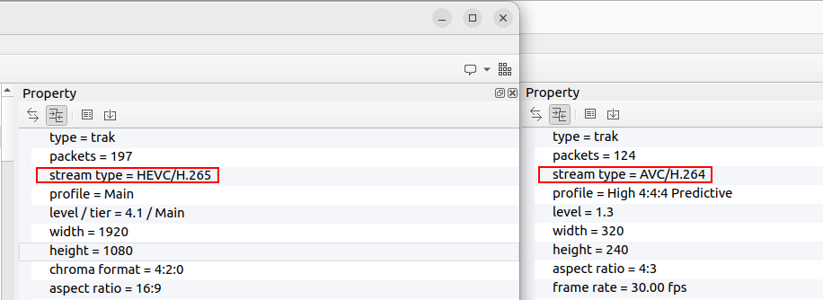

## 1 概念与术语

1. Box：MP4文件是由一个个Box组成的，可以将其理解为一个数据块，它由Header+Data组成，Data 可以存储媒体元数据和实际的音视频码流数据。Box可直接存储数据块，也可包含其它Box，我们把包含其它Box的Box称为container box。

2. Sample：可理解为采样，对于视频可理解为一帧数据，音频一帧数据就是一段固定时间的音频数据，可以由多个Sample数据组成，存储媒体数据的单位是sample。

3. Chunk：连续几个sample组成的单元被称为chunk，每个chunk在文件中有一个偏移量，整个偏移量从文件头算起，在这个chunk内，sample是连续存储的。

4. Track：表示一些chunk的集合，对于媒体数据而言就是一个视频序列或者音频序列，常说的音频/视频轨可对照该概念上。除了Video Track和Audio Track外，还可以有非媒体数据，比如Hint Track，这种类型的Track就不包含媒体数据，可以包含一些将其他数据打包成媒体数据的指示信息或者字幕信息。简单来说，Track是音视频中可以独立操作的媒体单位。

Trak里面有stream type（使用的是AVC/H.264或者）

## 

https://cloud.tencent.com/developer/article/1746996

https://blog.csdn.net/ProgramNovice/article/details/137641428

https://blog.csdn.net/m0_60259116/article/details/132714706

https://blog.csdn.net/u012117034/article/details/123746138