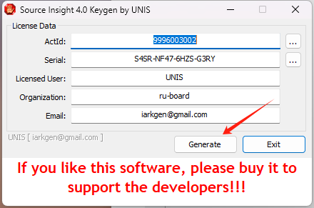
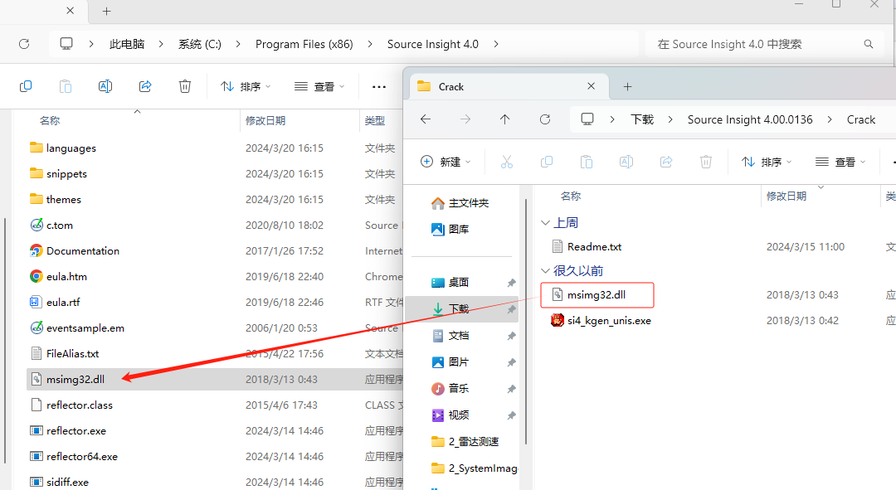

## 1 基本概念

### 1.1 重心

滑雪最重要的就是通过重心移动，控制重心变化，从而控制雪板。

推坡的时候重心要保持在双腿中间，后背挺直，目视前方别看脚下，看脚下重心就会前移，就会摔倒。

### 1.2 关节

滑雪过程中踝关节、膝关节、髋关节、肩关节都有不同的作用。

#### 1.2.1 踝关节

1. 脚踝锁住才能把刃离得更高。
2. 推坡的时候锁住脚踝，感受上半身重心的移动控制推坡的速度。

#### 1.2.2 肩关节

**1. 什么是开肩？**

上面图中的肩膀就是开肩，开肩可以获得更多的视野，也就是开肩后，头可以扭得角度更多，但是开肩的时候（比如像图中一样，向右后面开肩，肩会带动髋扭动，左腿就会弯曲，右腿就会蹬直，会导致重心靠后，重心靠后就会出现后脚扫雪的情况。

总结：
1. 开肩的好处，可以获得更多后刃视野，减小盲区防止被撞
2. 开放姿态更适合刻滑，倒伏立刃，开放姿态的折叠不容易撅屁股
3. 新手阶段肩膀和雪板同方向旋转不算开肩，反方向旋转会限制雪板转弯，不利于弯型控制。
4. 新手阶段开肩容易开胯，开胯容易使前腿更直，后腿更弯，重心偏板尾，换刃变得困难。
5. 开肩的原因可能是转头时更舒服或肩胯带动雪板换刃，新手建议用下半身关节发力来转弯换刃。

[视频讲解参考：https://www.bilibili.com/video/BV18e411r7z2/?vd_source=e6b01e2e688ed9241677df121e4b897a](https://www.bilibili.com/video/BV18e411r7z2/?vd_source=e6b01e2e688ed9241677df121e4b897a)

**2. 为什么要保持上半身不要晃动和开肩？**

答：减少上半身对雪板的影响。影响重心，基本站姿下，肩膀、髋、膝盖、雪板应处于平行状态。开肩会带动髋，带动膝盖向后刃旋转的力，影响前后脚的压力状态，重心向后脚移动，导致重心偏移（大多是靠后，通常可见为向后靠的姿势）；

先练好不开肩滑行，后期进阶再学开肩相关滑行

## 1.1 单板后刃推坡

后刃推坡的过程中，是靠我们的脚后跟和小腿来靠近固定器的背板 

## 1.2 单板前刃推坡

https://mbd.baidu.com/newspage/data/dtlandingsuper?nid=dt_5312383077391398230